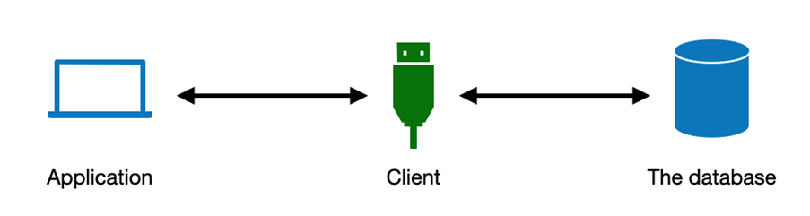

# Database clients

MySQL is an open-source SQL database management system. It is a relational database that stores data in separate tables. MySQL database software follows the client/server system, and the server can run on a desktop or a laptop while requiring little or no attention. It is fast, reliable, scalable, and easy to use. 

The MySQL client/server system consists of SQL servers that support several different client programs and APIs (Application Programming Interfaces) to administer the database. 

In a client/server system, MySQL as a database server is a software that acts as a backend where you can create and store databases. Whereas a client is a software that you can use to connect to the MySQL database server to perform required operations using SQL queries on the database. The client allows you to link the MySQL database in your applications. 

The MySQL database is designed to work with a range of software, programs, and computer languages. They all have specific clients to interact with the database and these clients are also called drivers or APIs.

In this course, you are using Python programming language to work with the MySQL backend database. You can illustrate the client/server system in which the database client [called client in the illustration] connects your Python-based data-centric application with the MySQL database by acting as a bridge between them. 

&nbsp;

&nbsp;

In the diagram, the client is a piece of code that bridges your front-end application with the back-end database. The client establishes a communication link between the application and the database to run your SQL queries according to your application’s needs. 

When you are working with Python, there are a range of clients available. The two most commonly used clients are MySQL Connector/Python and SQLAlchemy. The MySQL Connector/Python client is widely used and is a standardized database client or driver for Python platforms and development. The SQLAlchemy client also gives Python developers full control and flexibility to run SQL queries using Python on the MySQL database. 

To connect to the database using Python, you need to initiate a request to the client to establish a connection with the database. Once your request is accepted by the database, the database sends a confirmation message to the client. Python then uses that link to run the SQL queries. So, the clients make it possible to work with the backend MySQL database from your Python-based application. In this course, you’ll work with the “MySQL Connector/Python” database client.

&nbsp;

(source: [Database Clients](https://www.coursera.org/learn/database-clients))