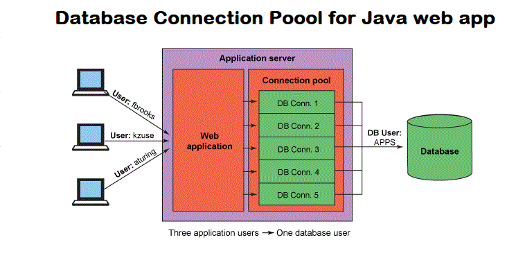

## 왜 커넥션 풀을 사용해야 하는가?

데이터베이스 연동 과정은 웹 애플리케이션이 필요할 때마다 데이터베이스 연결하여 작업하는 방식입니다.
그런데 이런 식으로 필요할 때마다 연동해서 작업할 경우 발생하는 문제가 하나 있습니다. 바로 데이터베이스 연결에 시간이 많이 걸린다는 것입니다.

이 문제를 해결하기 위해 현재는 웹 애플리케이션이 실행됨과 동시에 연동할 데이터베이스와의 연결을 미리 설정해 둡니다.
그리고 필요할 때마다 미리 연결해 놓은 상태를 이용해 빠르게 데이터베이스와 연동하여 작업을 합니다.
이렇게 미리 데이터베이스와 연결시킨 상태를 유지하는 기술을 커넥션풀(ConnectionPool)이라고 부릅니다.

## 커넥션풀 동작 과정

1. 톰캣 컨테이너를 실행한 후 응용 프로그램을 실행
2. 톰캣 컨테이너 실행 시 ConnectionPool 객체 생성
3. 생성된 커넥션 객체는 DBMS와 연결
4. 데이터베이스와의 연동 작업이 필요할 경우 응용 프로그램은 ConnectionPool에서 제공하는 메서드를 호출하여 연동

톰캣 컨테이너는 자체적으로 ConnectionPool 기능을 제공합니다. 톰캣 실행 시 톰캣은 설정 파일에 설정된 데이터베이스 정보를 이용해 미리 데이터베이스와 연결하여 ConnectionPool 객체를 생성한 후 애플리케이션이 데이터베이스와 연동할 일이 생기면 ConnectionPool 객체의 메서드를 호출해 빠르게 연동하여 작업합니다.

&nbsp;

Excerpt From <자바 웹을 다루는 기술> by 이병승
