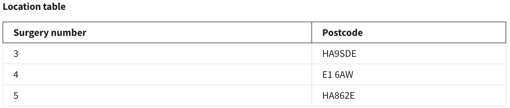

# Data normalization

The normalization process aims to minimize data duplications, avoid errors during data modifications and simplify data queries from the database. The three fundamental normalization forms are known as:

- First Normal Form (1NF)   
- Second Normal Form (2NF)   
- Third Normal Form (3NF)

The following example includes fictitious data required by a Medical Group Surgery based in London to generate relevant reports. Doctors work in multiple regions and various councils in London. And once a patient books an appointment, they are given a slot ID at their local surgery. There might be multiple surgeries in the same council but with different postcodes, where one or more councils belong to a particular region. For example, East or West London.  


&nbsp;

The data listed in the table are in an unnormalized form. Repeating groups of data appear in many cases, for instance, doctors, regions and council names. There are also multiple instances of data stored in the same cell such as with the patient name and total cost columns. This makes it difficult to update and query data.  Moreover, it is not easy to choose a unique key and assign it as a primary key.

## First normal form  

To simplify the data structure of the surgery table, let’s apply the first normal form rules to enforce the data atomicity rule and eliminate unnecessary repeating groups of data. **The data atomicity rule** means that you can only have one single instance value of the column attribute in any cell of the table.

The atomicity problem only exists in the columns of data related to the patients. Therefore, it is important to create a new table for patient data to fix this. In other words, you can organize all data related to the patient entity in one separate table, where each cell of any column contains only one single instance of data as depicted in the following example.


&nbsp;

This table includes one single instance of data in each cell, which makes it much simpler to read and understand. However, the patient table requires two columns: the patient ID and the Slot ID together to identify each record in a unique way. This means that you need a composite primary key in this table. To create this table in SQL you can write the following code:  

```sql
CREATE TABLE Patient  (PatientID VARCHAR(10) NOT NULL, PatientName VARCHAR(50), SlotID VARCHAR(10) NOT NULL, TotalCost Decimal,  CONSTRAINT PK_Patient PRIMARY KEY (PatientID, SlotID));  
```

Once you have removed the patient attributes from the main table, you just have the doctor ID, name, region, surgery number, council and postcode columns left in the table.   


&nbsp;

You may have noticed that the table also contains repeating groups of data in each column. You can fix this by separating the table into two tables of data: the doctor table and the surgery table, where each table deals with one specific entity.   


&nbsp;

 In the doctor table, you can identify the doctor ID as a single column primary key. This table can be created in SQL by writing the following code:  

```sql
CREATE TABLE Doctor  (DoctorID VARCHAR(10), DoctorName VARCHAR(50), PRIMARY KEY (DoctorID));  
```

Similarly, the surgery table can have the surgery number as a single column primary key. The surgery table can be created in SQL by writing the following code:  

```sql
CREATE TABLE Surgery  (SurgeryNumber INT NOT NULL, Region VARCHAR(20), Council  VARCHAR(20), Postcode VARCHAR(10), PRIMARY KEY (SurgeryNumber));   
```

By applying the atomicity rule and removing the repeating groups of data, the database now meets the first normal form.

## Second normal form  

In the second normal form, you need to avoid any **partial dependency** relationships between data. Partial dependency refers to tables with a composite primary key. Namely a key that consists of a combination of two or more columns, where a non-key attribute value depends only on one part of the composite key. 

Since the patient table is the only one that includes a composite primary key, you only need to look at the following table.  


&nbsp;

In the patient table, you need to check whether there are any non-key attributes depending on one part of the composite key. For example, the patient's name is a non-key attribute, and it can be determined by using the patient ID only. 

Similarly, you can determine the total cost by using the Slot ID only. This is called partial dependency, which is not allowed in the second normal form. This is because all non-key attributes should be determined by using both parts of the composite key, not only one of them.

This can be fixed by splitting the patient table into two tables: patient table and appointment table. In the patient table you can keep the patient ID and the patient's name.


&nbsp;

The new patient table can be created in SQL using the following code:

```sql
CREATE TABLE Patient  (PatientID VARCHAR(10) NOT NULL, PatientName, VARCHAR(50), PRIMARY KEY (PatientID));  
```

However, in the appointment table, you need to add a unique key to ensure you have a primary key that can identify each unique record in the table. Therefore, the appointment ID attribute can be added to the table with a unique value in each row of the table.


&nbsp;

The new appointments table can be created in SQL using the following code:

```sql
CREATE TABLE Appointments  (AppointmentID INT NOT NULL, SlotID, VARCHAR(10),  TotalCost Decimal, PRIMARY KEY (AppointmentID));  
```

Now you have removed the partial dependency and all tables conform to the first and second normal forms.

## Third normal form  

For a relation in a database to be in the third normal form, it must already be in the second normal form (2NF). In addition, it must have no transitive dependency. This means that any non-key attribute in the surgery table may not be functionally dependent on another non-key attribute in the same table. In the surgery table, the postcode and the council are non-key attributes, and the postcode is dependent on the council. Therefore, if you change the council value, you must also change the postcode. This is called transitive dependency, which is not allowed in the third normal form.


&nbsp;

In other words, changing the value of the council value in the above table has a direct impact on the postcode value, because each postcode in this example belongs to a specific council. This transitive dependency is not allowed in the third normal form. To fix it you can split this table into two tables: one for the region with the city and one for the surgery.   



&nbsp;

 The new surgery location table can be created in SQL using the following code:

```sql
CREATE TABLE Location  (SurgeryNumber INT NOT NULL, Postcode VARCHAR(10), PRIMARY KEY (SurgeryNumber)); 
``` 


&nbsp;

The new surgery council table can be created in SQL using the following code:

```sql
CREATE TABLE Council  (Council VARCHAR(20) NOT NULL, 
Region VARCHAR(20), PRIMARY KEY (Council));  
``` 

This ensures that the database now conforms to first, second and third normal forms. The following diagram illustrates the stages through which the data moves from the unnormalized form to the first normal form, the second normal form and finally to the third normal form.  


&nbsp;

However, it’s important to link all tables together to ensure that you have well-organized and related tables in the database. This can be done by defining foreign keys in the tables.  


&nbsp;

The third normal form is typically good enough to deal with the three anomaly challenges – insertion, update and deletion anomalies – that the normalization process aims to tackle. Completing the third normal form in a database design helps to develop a database that is easy to access and query, well-structured, well-organized and consistent and without unnecessary duplications of data.

&nbsp;

(sourece: https://www.coursera.org/learn/introduction-to-databases)