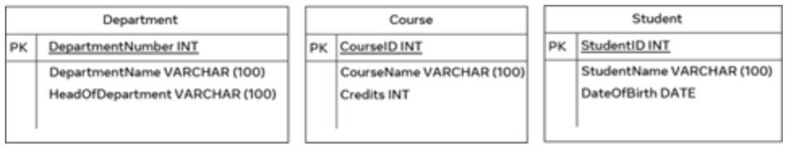

# Entity relationship diagrams (ERD)

The use of entity relationship diagrams helps to provide the big picture of your database. It also ensures the data requirements and operations are well defined and documented in your project. In addition, the ER-D represents a blueprint that guides database developers through the implementation of the actual database in a relevant database management system such as Oracle and MySQL. 

The entities, attributes and relationships between entities can be shown in a variety of diagrammatic formats in the ER diagrams. In this reading, you’ll review the most used shapes and symbols.

## Entity representation

In the ER-D, a box with two compartments is used to represent the entity and its related attributes. The top compartment represents the entity name, and the bottom compartment includes the related attributes. 

&nbsp;

## Relationship representation

The ER diagram uses different styles of lines to define the distinct types of relationships between entities. The line style depends on the cardinality of the relationship, which refers to the number of elements in a set of data as clarified in the following three cases.

### 1:1 (one-to-one)

The ER-D uses a straight-line representation for a one-to-one cardinality relationship. For example, each passenger on a train should have only one ticket. 

&nbsp;

### 1:N (one-to-many)

The ER-D is a straight line with a crow’s foot notation on one side only to represent a one-to-many cardinality relationship. For example, one parent can have many children. 

&nbsp;

### M:N (many-to-many)

The ER-D is a straight line with crow’s foot notations on both sides of entities to represent a many-to-many cardinality relationship. For example, many players play many games.

&nbsp;

## Attributes representation

Each entity has a set of attributes that hold relevant information about it. Each attribute must be defined with a data type. 

In the college enrolment example, you can list the following attributes followed by relevant data types:

- The department attributes: department number, department name and head of department.
- The course attributes: course ID, course name, and course credits.
- The student attributes: student ID, name, and date of birth.

The three entities can be listed as three separate tables. 

&nbsp;

(sourece: [Introduction to Databases](https://www.coursera.org/learn/introduction-to-databases))