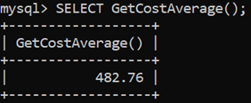

# Differences between functions and stored procedures

## Overview of functions and procedures in MySQL

In many programming languages, functions are called procedures. In some other programming languages such as SQL there are several key differences between these two terms.  

However, it is important to realize that both terms represent the same concept of wrapping or encapsulating code together in the body of the function or the procedure. This function or procedure is then called to perform a specific operation by invoking the identifier name.

The main purpose of creating stored procedures and functions is to create reusable code that can be invoked and executed in an efficient way. So, instead of typing the same code repeatedly, you can save your blocks of code in a stored procedure or a function. You can then call these blocks when you need to use your code. 

This makes your code more consistent, better organized, reusable and easier to maintain. 

For example, the following query can be used to return the names of all clients in the Clients table from the Lucky Shrub database:

```sql
SELECT * FROM Clients;
```

You can wrap this statement in a stored procedure as follows:

```sql
DELIMITER //
CREATE PROCEDURE GetAllClients()
BEGIN
SELECT * FROM Clients;
END //
DELIMITER;
```

You can invoke this procedure simply by calling the identifier name as shown in the following screenshot. This is the output result of calling the GetAllClients() procedure.

The following query is an example of a function that returns the average cost of all orders in the Orders table from the Lucky Shrub database.

```sql
SELECT AVG(Cost) FROM Orders;
```

You can wrap this statement in a stored function as follows:

```sql
DELIMITER //
CREATE FUNCTION GetCostAverage() RETURNS DECIMAL(5,2) DETERMINISTIC 
BEGIN
RETURN (SELECT AVG(Cost) FROM Orders);
END //
DELIMITER;
```

You can invoke this function simply with a select statement as shown in the following screenshot which shows the output result of calling the GetCostAverage() procedure:



&nbsp;

## Key differences between functions and procedures

A function in MySQL is also called a stored function. A procedure is called a stored procedure. Basic stored procedures and functions typically represent operations that contain empty parameters, or simple input parameters, and a single SQL statement.

More complex procedures and functions require the use of additional features like complex parameters, variables, changing delimiters and the use of BEGIN-END keywords. They also often require the use of multiple SQL statements in the body of the procedure. 

In this context, key differences between functions and procedures are as follows:

- A function returns a single value, whereas a procedure may return a single value, multiple values or no value. 
- Typically, functions encapsulate common formulas or generic business rules that are reusable among SQL statements and stored procedures. Procedures, on the other hand, are used mainly to process, manipulate and modify data in the database.
- Functions only accept input parameters, while stored procedures can accept IN, OUT and INOUT parameters.
- Functions can be invoked from anywhere, including SELECT statements and stored procedures. Stored procedures are invoked using the CALL statement only.   
- A stored function is created using the CREATE FUNCTION statement. A stored procedure is created using the CREATE PROCEDURE statement. 
- To build a function, you should specify if it is a DETERMINISTIC function or not. This means that you need to decide if the function always returns the same result for the same input parameters. If you don't use DETERMINISTIC, then MySQL uses the NOT DETERMINISTIC option by default.     
- To build functions you must specify the data type of the return value in the RETURNS statement. This can be any valid MySQL data type. However, there’s no need to do this with stored procedures. 

The following table provides a summary of the key differences between stored procedures and stored functions.

||Functions|Procedures|
|---|---|---|
| 1 |Created using CREATE FUNCTION command| Created using the CREATE PROCEDURE command| 
| 2 | Invoked using the SELECT statement | Invoked using the CALL statement |
| 3 | Must return a single value | Outputs values via the OUT parameter|
| 4 | Takes IN parameters only | Takes IN, OUT and INOUT parameters |
| 5 | Typically encapsulates common formulas or generic business rules | Typically used to process, manipulate and modify data in the database |
| 6 | Must specify the data type of the return value | User must specify the OUT parameter type| 

&nbsp;

## Conclusion

Functions and procedures are used to encapsulate code that can be executed to implement repetitive tasks such as equations, formulas or business rules.

In addition, functions and stored procedures make your code more consistent, reusable and easier to use and maintain. 

However, you should be aware of the key differences between functions and procedures in MySQL so that you know when to use one over the other.

&nbsp;

(source: [Advanced MySQL functions and stored proceduresL](https://www.coursera.org/learn/advanced-mysql-topics))