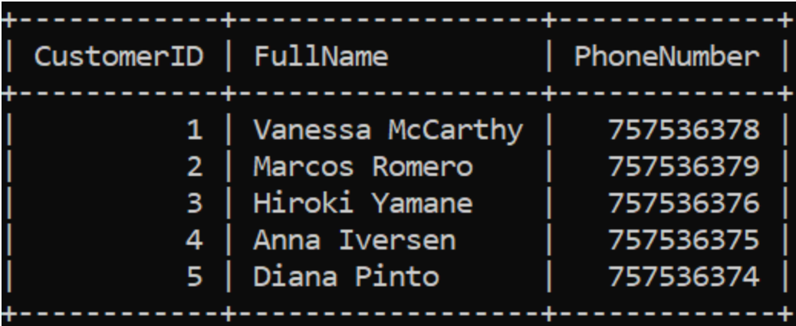
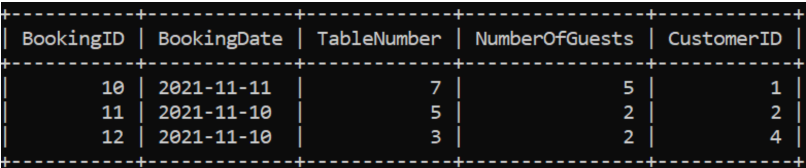
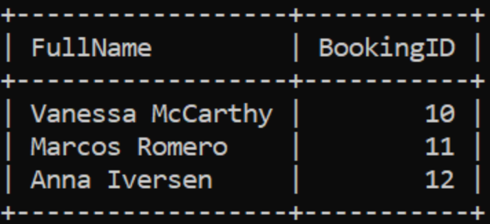
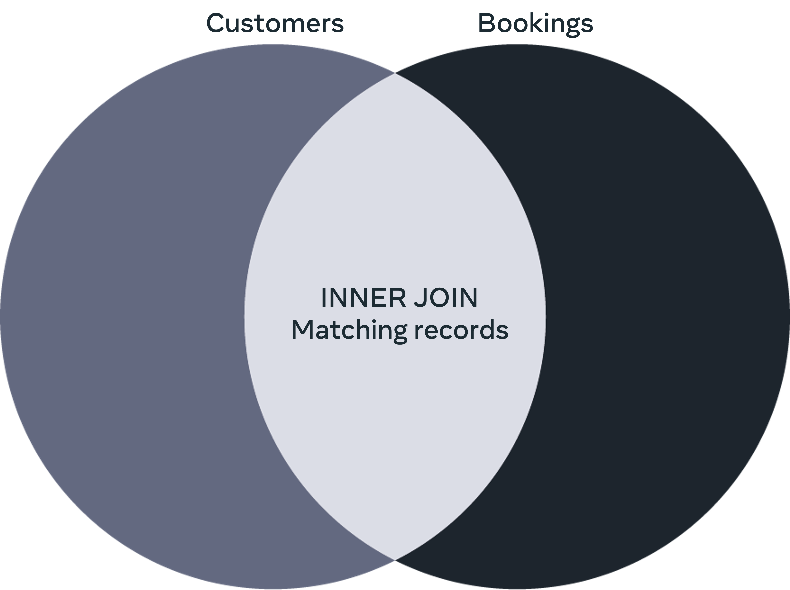
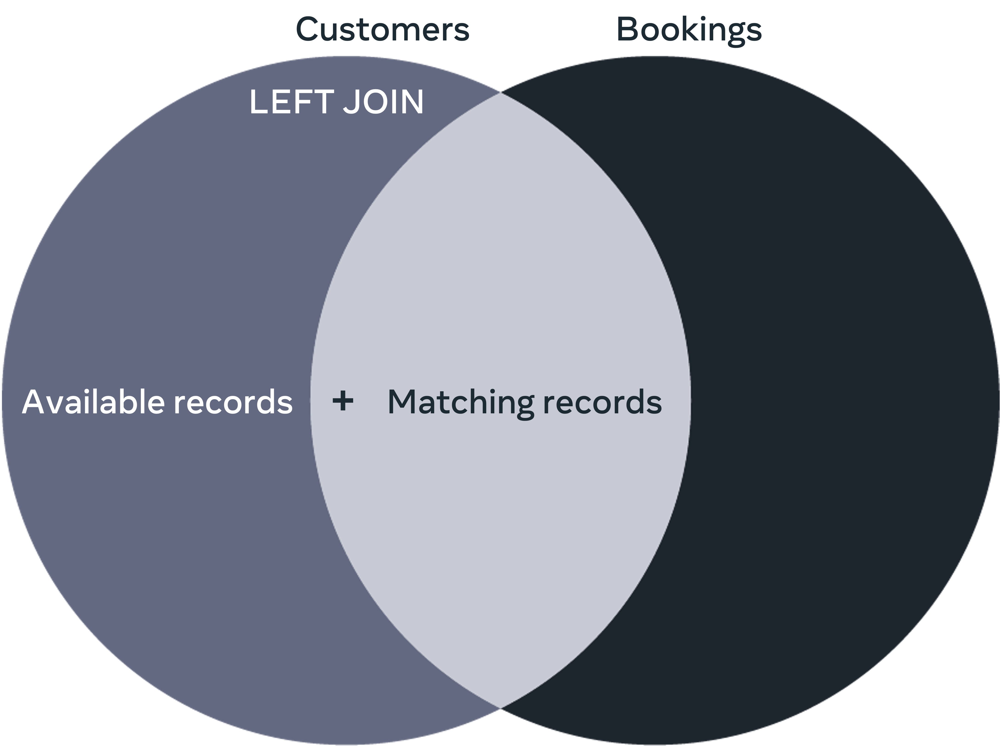
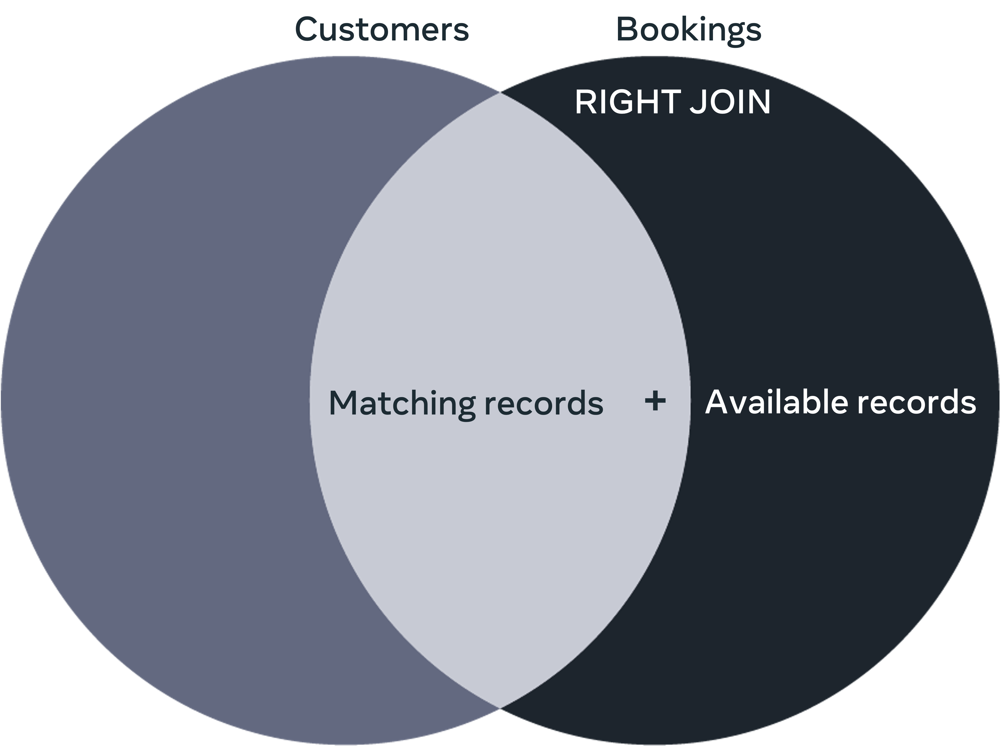
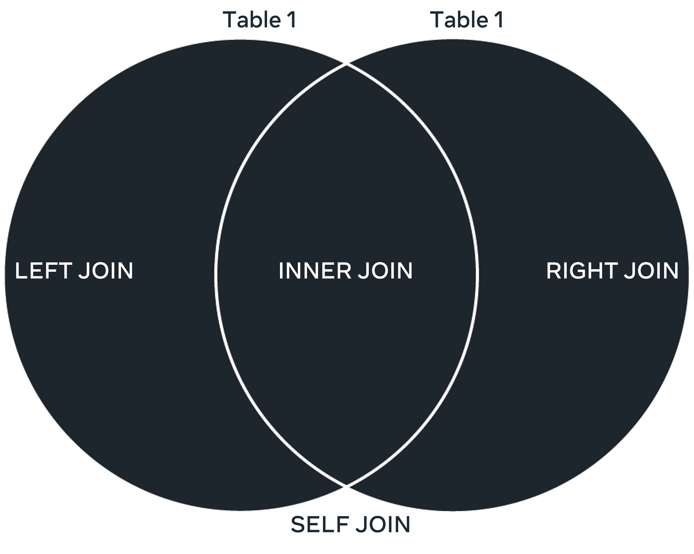

# Joining Tables

## What is a JOIN? 

A join in a database links records of data between one or multiple tables based on a common column between them.

## Why do you need to use a JOIN?

Sometimes you want to find information about a specific activity or object in the database, where the relevant information exists in more than one table. In this situation, you can use the SQL JOIN clause to query the required data from multiple tables. 

There are four different types of joins supported in MySQL that are covered in this lesson.  

- INNER JOIN 
- LEFT JOIN 
- RIGHT JOIN 
- SELF-JOIN 

To explain the difference between these types of JOINS, let's look at the Little Lemon restaurant database, which includes two tables.

The first is the Customers table with the following columns:

- CustomerID, 
- FullName 
- and PhoneNumber columns, as shown below: 



&nbsp;

The second is the bookings table with the columns:

- BookingID, 
- BookingDate, 
- TableNumber, 
- NumberOfGuests 
- and CustomerID columns.



&nbsp;

You may have noticed that both tables contain the Customer ID column, which represents a common column.  

## INNER JOIN 

This type of JOIN returns records of data that have matching values in the joined tables. For example, assume that you want to return the full name and booking ID of customers who made bookings. In this situation, you can use the INNER JOIN clause to extract records of data from the Customers and the Bookings tables based on the matching customer ID value as follows.

```sql
SELECT Customers.FullName, Bookings.BookingID 
FROM Customers INNER JOIN Bookings 
ON Customers.CustomerID = Bookings.CustomerID; 
```

The outuput result shown below



&nbsp;

The INNER JOIN is illustrated in the following Venn diagram. 



&nbsp;

## LEFT JOIN 

You can use the LEFT JOIN clause to extract the full names and the booking IDs from the Customers and the Bookings tables as follows:

```sql
SELECT Customers.FullName, Bookings.BookingID 
FROM Customers LEFT JOIN Bookings 
ON Customers.CustomerID =  Bookings.CustomerID; 
```

The LEFT JOIN returns all common records in a similar way to the INNER JOIN, plus all queried records from the left table regardless of whether there is a match in the right table or not. If there are no matching records in the right table, then null values will be inserted for the bookings IDs. 

The LEFT JOIN is illustrated in the following Venn diagram.



&nbsp;

RIGHT JOIN 

You can use the RIGHT JOIN clause to extract the full names and the booking IDs from the Customers and the Bookings tables as follows:

```sql
SELECT Customers.FullName, Bookings.BookingID 
FROM Customers RIGHT JOIN Bookings 
ON Customers.CustomerID = Bookings.CustomerID;
```

The output of this query is as follows:


&nbsp;

The RIGHT JOIN returns all common records in a similar way to the INNER JOIN, plus all queried records from the right table regardless of whether there is a match in the left table or not. If there are no matching records in the left table, then null values will be inserted for the customers full names.

The RIGHT JOIN is illustrated in the following Venn diagram.



&nbsp;

## SELF JOIN 

This is a special case where you need to join a table with itself to get specific information existing in the same table.  In this case you may choose the INNER JOIN, LEFT JOIN or RIGHT JOIN presented earlier to query the required data. 

The SELF JOIN is illustrated in the following Venn diagram.



&nbsp;

(source: [Database Structures and Management with MySQL](https://www.coursera.org/learn/database-structures-and-management-with-mysql/))