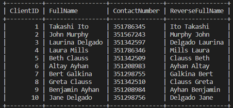
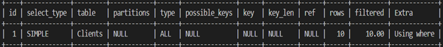
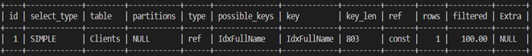

# Database optimization in practice with SELECT statements

## Importance of SELECT query optimization

Optimizing SELECT queries involves reducing the amount of time it takes for a query to retrieve  data from a database. The time taken to execute a SELECT query depends mostly on the amount of data (number of rows) that it must work with.

SELECT statements, also known as data retrieval statements, play an important role in a database application. They perform all the database search operations. Database search operations are expensive, and they require a fast response time. So, efficient SQL SELECT statements are important for the effective performance of a database application.

To optimize SELECT queries, create indexes on table columns that are frequently queried. Indexes reduce the number of rows that a query needs to read or scan. The MySQL Query Optimizer steps in when SELECT queries are executed and devises an optimal query execution plan.

As a database engineer, you can assist the MySQL query optimizer by applying simple techniques such as:

- Avoiding the use of unnecessary columns in the SELECT clause.
- Avoiding the use of functions in predicates (WHERE clause conditions).
- Avoiding the use of leading wildcards in predicates, particularly with the LIKE operator.
- Using INNER JOIN instead of OUTER JOIN. 
- Using DISTINCT and UNION sparingly in SELECT queries.

## Optimizing SELECT queries with the EXPLAIN statement

When a SELECT query is issued against a database, the MySQL Query Optimizer devises an optimal plan for query execution. You can see what this plan looks like by prefixing the query with EXPLAIN. The EXPLAIN statement provides information about how the query is executed. 

It is important that you understand each piece of information clearly, so that you can utilize it in practice to optimize SELECT queries that have bottlenecks or are designated as suboptimal.

An EXPLAIN statement is prepended to a SELECT query to retrieve information on the plan that MySQL uses to execute the given query, as the following syntax example shows:

```sql
EXPLAIN SELECT column_name 
FROM table_name 
WHERE VALUE
```

To understand this concept, let’s explore an example from the Lucky Shrub database. 

Lucky Shrub’s database has a Clients table that contains 10 rows. Lucky Shrub need to retrieve the contact number of the client Jane Delgado. 



&nbsp;

They can use the EXPLAIN statement and a SELECT query to generate a plan for the query execution:

```sql
EXPLAIN SELECT ContactNumber 
FROM Clients 
WHERE FullName='Jane Delgado';
```

This query shows a plan of how the query will be executed. Out of the 12 columns, this result has 10 important columns that provide useful information about how the query is executed. By analyzing the results, you can take action to improve the query’s performance.



&nbsp;

## Overview of EXPLAIN statement results

Let’s examine these columns one by one.

### Column 01: ID

The ID column is a sequential identifier for each SELECT statement within the query. This piece of information is more meaningful when there are nested queries, or subqueries.

The Lucky Shrub example has a value of 1 as it is a simple example of a single query.

### Column 02: SELECT_TYPE

This column displays the type of SELECT query to be executed.

There are several values that can be assigned to the SELECT query:

|Value|Description|
|:---|:---|
|SIMPLE|Simple SELECT query without any subqueries or UNIONS|
|PRIMARY|The SELECT is in the outermost query in a JOIN|
|DERIVED|The SELECT is part of a subquery within a FROM clause|
|SUBQUERY|The first SELECT in a subquery|
|DEPENDENT SUBQUERY| The SELECT statements is a subquery dependent on an outer query|
|UNCACHEABLE SUBQUERY|Subquery which is not cacheable (there are certain conditions for a query to be cacheable)|
|UNION|The SELECT query is the second or later statement of a UNION|
|DEPENDENT UNION|The second or later SELECT of a UNION is dependent on an outer query|
|UNION RESULT|The SELECT is a result of a UNION|

Lucky Shrub's query has returned a value of SIMPLE because it is a basic query that contains no subqueries or unions.

### Column 03: Table

This column displays the name of the table referred to in the SELECT query. Lucky Shrub's SELECT query refers to the Clients table.

### Column 04: Partitions

This column displays the partition in which the data resides (the area of physical storage that's scanned). Partitioning allows for the distribution of portions of table data across the file system. If the queries access only a fraction of table data, then there's less records to scan and queries can execute faster. However, partitioning is more meaningful when dealing with large data sets.

Lucky Shrub's Clients table is not partitioned. So, it shows a NULL value in that column.

### Column 05: type 

Scanning the table means performing a search operation or finding matches specified by the SELECT query.

The following table outlines a list of the most prominent possible values:

|Value|Description|
|:---|:---|
|system|The table has only one row or zero rows. This return value typically indicates that the search was performed on a system table.|
|const|Indicates that the value of the searched column can be treated as a constant (there is one row matching the query)|
|eq_ref| Indicates that the index is clustered and is being used by the operation (either the index is a PRIMARY KEY or UNIQUE INDEX with all key columns defined as NOT NULL)    |
|ref|Indicates that the indexed column was accessed using an equality operator. You can see an example of this in the optimized Lucky Shrub query EXPLAIN statement results, as the indexed column FullName is matched or accessed using the = operator in the WHERE clause.    |
|full text|The scan uses the table’s FULLTEXT index. Full-text indexes are created on text-based columns (CHAR , VARCHAR , or TEXT columns)    |
|index|The entire index is scanned to find a match for the query    |
|all|The entire table is scanned to find matching rows. This is the worst scan type and usually indicates the lack of appropriate indexes on the table.    |

Lucky Shrub’s query returns a value of ALL. This indicates that MySQL scans the entire table (each row) to find the matching rows. This suggests that there’s a problem with executing this query. In other words, this is a suboptimal query. This is because there’s no index defined on the table.

### Column 06: possible_keys 

This column shows the keys that can be used by MySQL to find rows from the table. However, these keys may or may not be used in practice. If the column value is NULL, then it indicates that no relevant indexes are found.

The Lucky Shrub example has a NULL value, which indicates that there are no keys or indexes in the table which MySQL can use to find or filter rows. This indicates a problem that needs to be addressed.

### Column 07: key

Indicates the actual index used by MySQL. 

In the Lucky Shrub example, this column returns a NULL value. This means there’s no index in the table that can be used by the optimizer. This is a problem that needs to be addressed, because an index is required for optimization.

### Column 08: key_len

This column indicates the length of the index the Query Optimizer chooses to use. For example, a key_len value of 4 means it requires memory to store four characters. 

Lucky Shrub’s database returns a NULL value again because there is no index that can be used by this query.

### Column 09: ref

This column shows which table columns have been compared to the index to perform the search. A value of const means a constant, while a value of func means that the value that was used was derived from a function.

In Lucky Shrub's database, no columns or constants are compared against an index, because the table doesn’t have one. Therefore, the value is NULL. This once again highlights the problem of not using an index in a table.

## Column 10: rows 

Lists the number of records that were examined to produce the output.

Lucky Shrub's results indicate that there were 10 records examined by the query. This means that every row in the table was examined. This is an inefficient use of the database's resources. 

If there were hundreds, or even thousands of records in a table, then an inefficient query would have to examine each one. This would take much longer, and use more resources, than an efficient query which only needs to examine the required records.

## Column 11: filtered

This column indicates an approximate percentage of the number of table rows that have been filtered by a specified condition. The higher the percentage is, the better the performance of the query.

In the Lucky Shrub query, 10% of the rows in the Clients table are filtered by the WHERE clause condition.

### Column 12: Extra

Contains additional information regarding the query execution plan. Pay attention if there are values like  Using temporary or Using filesort in this column as they indicate a problematic query. Let's take a quick look at what these values mean.

- Using temporary: This value Indicates that MySQL needs to create a temporary table to hold the result of this query. This typically happens if the query contains GROUP BY and ORDER BY clauses that list columns differently (In other words, when the columns listed in the GROUP BY and ORDER BY clauses are different).

- Using filesort: This value indicates that MySQL must perform an extra pass to determine how to retrieve the rows in sorted order. The sort is performed by going through all rows according to the type (mentioned earlier) and storing the sort key and pointer to the row for all rows that match the WHERE clause. The keys then are sorted, and the rows are retrieved in sorted order. 

Lucky Shrubs example has a value of Using where. This indicates that MySQL first reads each row within the table before it filters them. This is not an efficient way for a query to make use of the WHERE clause. If an index was defined on the Clients table, then the value here would be different.

&nbsp;

## Planning a more efficient SELECT query

The use of an index on the required column, or columns, results in more efficient SELECT queries that processes records faster using less resources.

For example, Lucky Shrub can add an index on the FullName column using the following code:

```sql
CREATE INDEX IdxFullName ON Clients(FullName);
```

Then, when the EXPLAIN statement is executed, it can return more detailed results:



&nbsp;

Attention needs to be paid to the following columns:

- type  
- possible_keys, 
- keys, 
- ref,  
- rows 
- and Extra.

With the index in place on the FullName column, type indicates that MySQL now scans all the matching rows of the indexed column FullName. In this case there’s only 1 row that matches the indexed column’s value - Jane Delgado. 

Possible_keys indicates that there’s a possible index that can be used to find the required rows. This is the IdxFullName index. The index speeds up the query’s performance.

key indicates that the index named IdxFullName is used to locate the required value. By using the name of the index, the query can locate the required information faster.

Ref shows that a constant value (Jane Delgado) is compared to the index shown in the key column. In other words, the statement has a value to reference against the index.

The rows column indicates that only one row was examined to produce the output. This shows that MySQL was able to execute the statement quickly and efficiently without the need to examine all records in the table.

Conclusion
Running SELECT queries with an EXPLAIN statement is a helpful method for optimizing SELECT queries in practice. Attention needs to be paid to the type, possible_keys, keys, ref and rows columns in the EXPLAIN statement results that indicate specific issues in a SELECT query that require optimization.