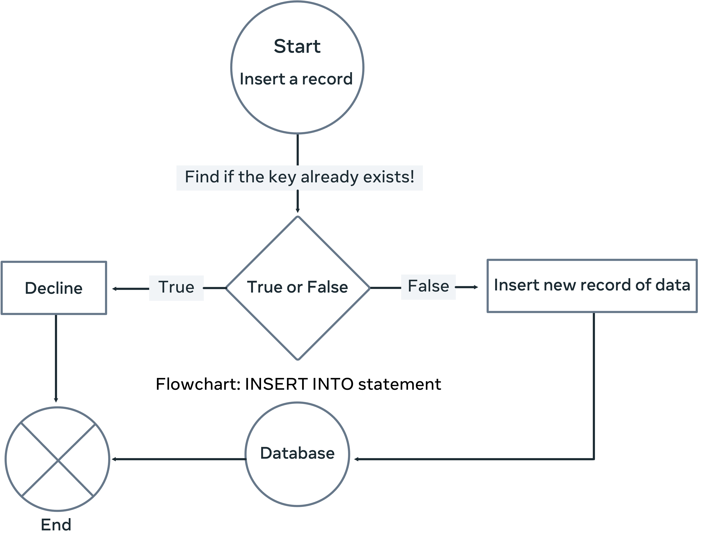
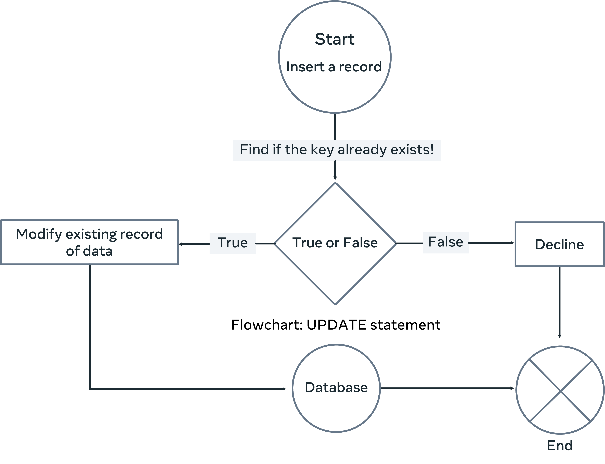
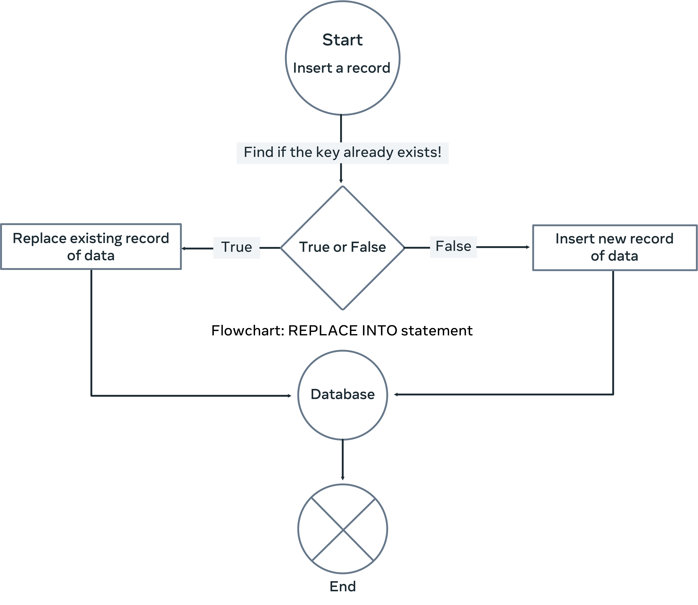

# MySQL REPLACE statement

## What is the REPLACE statement in MySQL?

The MySQL REPLACE statement is an alternative way to insert and update data in a database table. It is an extension to the SQL Standard, which inserts or updates data in a table. You use it for slightly different purposes than the standard INSERT INTO and UPDATE. (This will be clarified later in this reading when it is explained how each of the three statements works.)

You can use two types of syntax to insert or update data with the REPLACE statement. The first syntax is very similar to the standard SQL INSERT INTO statement, where you utilize the REPLACE command instead of the INSERT command as follows: 

```sql
REPLACE INTO table_name (column1name, column2name, ...) 
VALUES (value1, value2, ...);
```

The second syntax is similar to the standard SQL UPDATE statement, where you utilize the REPLACE command with the SET keyword to update data in the table like this. 

```sql
REPLACE INTO table_name SET column1name = value, column2name = value, ... ;
```

Now, since the INSERT INTO statement inserts data and the UPDATE statement updates data, what is the need for the REPLACE statement?

To answer this question, you need to understand how each of the three statements works.

&nbsp;

## How the INSERT INTO statement works

The INSERT INTO statement attempts to insert a new record of data. It checks if the unique key already exists in the table. If YES or TRUE, the insert process is declined, and MySQL generates an error message. 

Suppose a value of NO or FALSE is returned. In that case, the insert process is completed, and the new data record is added to the database. A flowchart that demonstrates how the INSERT INTO statement works is illustrated below.



&nbsp;

## How the UPDATE statement works

The update statement attempts to modify an existing record with new data. It checks if the unique key already exists in the table. Suppose a value of NO or FALSE is returned. In that case, the update process is declined, and MySQL generates an error message. 

Suppose it returns a value of YES or TRUE. In that case, the update process is completed, and the existing data record is modified with the new data. A flowchart demonstrating how the UPDATE statement works illustrated below.



&nbsp;

### How the REPLACE INTO statement works

The REPLACE statement checks whether the intended data record's unique key value already exists in the table before inserting it as a new record or updating it. 

The REPLACE INTO statement attempts to insert a new record or modify an existing record. In both cases, it checks whether the unique key of the proposed record already exists in the table. Suppose a value of NO or FALSE is returne. In that case, the REPLACE statement inserts the record similar to the INSERT INTO statement.

Suppose the key value already exists in the table (in other words, a duplicate key). In that case, the REPLACE statement deletes the existing record of data and replaces it with a new record of data. This happens regardless of whether you use the first or the second REPLACE statement syntax.

A flowchart outlining how the REPLACE INTO statement works is illustrated below.



&nbsp;

Once the REPLACE INTO statement is used to insert or modify data, it determines first whether the new data record already exists in the table. It checks if the PRIMARY or the UNIQUE KEY matches one of the existing records. 

If there is no matching key, the REPLACE works like a normal INSERT statement. Otherwise, it deletes the existing record and replaces it with the new one. This is considered a sort of modification or update of an existing record. However, it would be best if you were careful here. Suppose you do not specify a value for a column in the SET clause. In that case, the REPLACE statement uses the default value (if a default value has been set). Otherwise, it's set as NULL.

&nbsp;

(source: [Database Structures and Management with MySQL](https://www.coursera.org/learn/database-structures-and-management-with-mysql/))