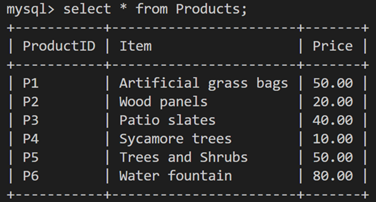

# MySQL stored procedures

## What is a stored procedure? 

The stored procedure in MySQL is a set of SQL instructions wrapped within the CREATE PROCEDURE statement to achieve a particular objective. 

For example:

```sql
CREATE PROCEDURE GetItalianCustomers() SELECT * FROM Customers WHERE Country = “Italy”;
```

This stored procedure returns all customers from Italy by just calling the identifier of the procedure as follows:

```sql
CALL GetItalianCustomers();
```

&nbsp;

## Why use stored procedures?

The main idea behind creating stored procedures is to create reusable code that can be invoked and executed efficiently.

So, instead of typing the same code repeatedly, you can save your blocks of code in a stored procedure as a prepared query that you can use whenever needed.

You can create as many procedures as you need. Each procedure can have a unique name, zero or several parameters and contain blocks of code, including SQL statements, variables and conditions.

Stored procedures make the code more consistent, reusable and easier to use and maintain. 

## When to create a stored procedure with parameters?

Each procedure must achieve a clear objective. For example, suppose you expect users to input a value when calling a procedure. In that case, you need to specify a parameter with a suitable data type. Otherwise, the procedure will be created with a parameter of zero.

For example, the Products table from the Lucky Shrub database includes 3 columns: product id, item name and product price. The table is populated with relevant data, as shown below. 

&nbsp;



&nbsp;

You can create a basic stored procedure with empty (or zero) parameters and one single SQL statement by typing the following query. 

```sql
CREATE PROCEDURE GetProductsDetails() SELECT * FROM Products; 
```

This procedure returns all records from the Products table. No argument (user input value) is expected to be passed to the procedure to execute it. That is why it has no parameter within the parentheses. 

Other times, you may want to create a stored procedure with one or more parameters to process the query based on a user-specified value. For example, you can create a stored procedure to retrieve data from the products table based on the user input of a specific price. To do this, you can write a procedure with one parameter as follows:

```sql
CREATE PROCEDURE GetProductsBasedOnPrice (inputPrice INT) 
SELECT * FROM Products WHERE Price <= inputPrice;
```

In this statement, you declare a parameter with an INT datatype to pass an integer value into the stored procedure to make the query act based on this value.

In this case, you can return all data from the Products table where the product price is less than or equal to the user input value. Here's an example of the code:

```sql
CALL GetProductsBasedOnPrice (50);
```

This lists all products with prices less than or equal to $50 as shown on the screen below. 

&nbsp;

(source: [Database Structures and Management with MySQL](https://www.coursera.org/learn/database-structures-and-management-with-mysql/))