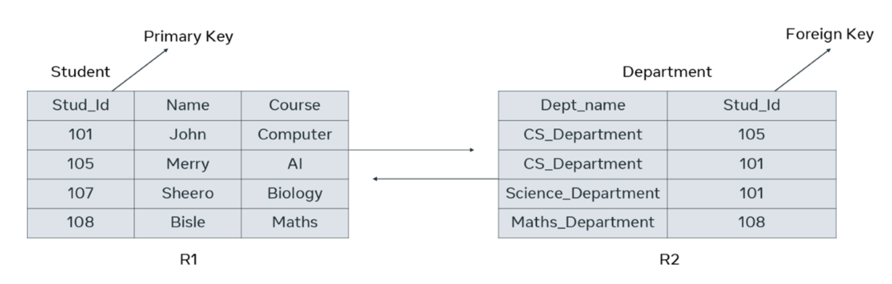

# Tables

A table is the most basic type of database object in relational databases. It is responsible for storing data in the database.

&nbsp;

## What are data types?

Every column in a table has a data type. These data types are defined by SQL or Structured Query Language. A data type defines the type of value that can be stored in a table column. 

For example, here are some of the data types that are available:

- Numeric data types such as INT, TINYINT, BIGINT, FLOAT, REAL. 

- Date and time data types such as DATE, TIME, DATETIME. 

- Character and string data types such as CHAR, VARCHAR. 

- Binary data types such as BINARY, VARBINARY. 

- Miscellaneous data types such as: 

    - Character Large Object (CLOB) for storing a large block of text in some form of text encoding.   

    - Binary Large Object (BLOB) for storing a collection of binary data such as images. 

&nbsp;

## Tables in a relational database

In a relational database there are multiple tables representing the structure of the back end of a software system. For example, in the context of a Student Information System, the tables might include Student, Teacher, Class and Subject.

In relational database terminology a table is also known as a **relation**. A table row or a record is also known as a tuple.

Each table or relation in a database has its own schema. Schema simply means the structure. The structure includes:

- the name of the table or relation  

- its attributes

- their names  

- data type 

&nbsp;

&nbsp;

## What is a primary key?

In a table, there is a field or column that is known as a key which can uniquely identify a particular tuple (row) in a relation (table). This key is specifically known as a primary key.

&nbsp;

## What is a foreign key?

Tables in a database do not stay isolated from each other. They need to have relationships between them. Tables are linked with one another through a key column (the primary key) of one table that’s also present in the related table as a foreign key.

&nbsp;

## Integrity constraints

Every table in a database should abide by rules or constraints. These are known as integrity constraints.

There are three main integrity constraints:

1. Key constraints

2. Domain constraints

3. Referential integrity constraints

&nbsp;

### What are key constraints?

In every table there should be one or more columns or fields that can be used to fetch data from tables. In other words, a primary key. The key constraint specifies that there should be a column, or columns, in a table that can be used to fetch data for any row. This key attribute or primary key should never be NULL or the same for two different rows of data. For example, in the student table I can use the student ID to fetch data for each of the students. No value of student ID is null, and it is unique for every row, hence it can be the key attribute.

&nbsp;

### What are domain constraints?

Domain constraints refer to the rules defined for the values that can be stored for a certain column. For instance, you cannot store the home address of a student in the first name column. Similarly, a contact number cannot exceed ten digits.

&nbsp;

### What are referential integrity constraints?

When a table is related to another table via a foreign key column, then the referenced column value must exist in the other table. This means, according to the student and department examples, that values should exist in the student ID column in the student table because the two tables are related via the student ID column.

&nbsp;

(source: [Introduction to Databases](https://www.coursera.org/learn/introduction-to-databases))