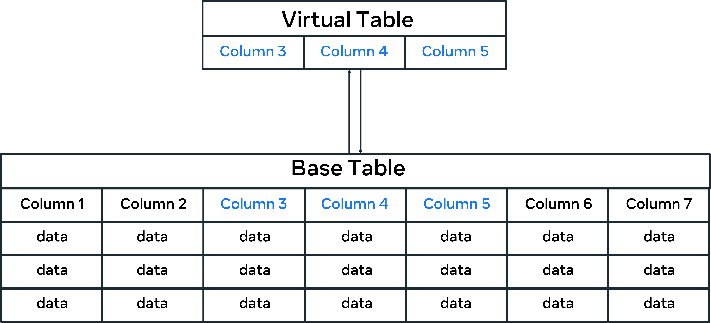
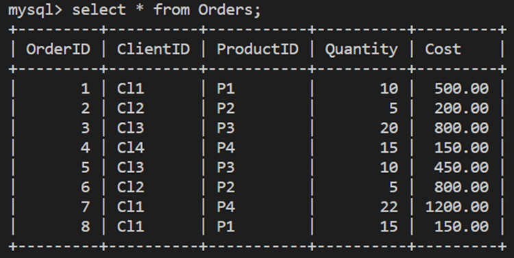
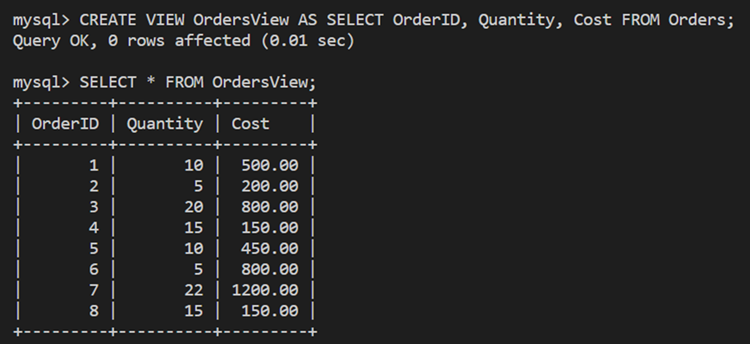
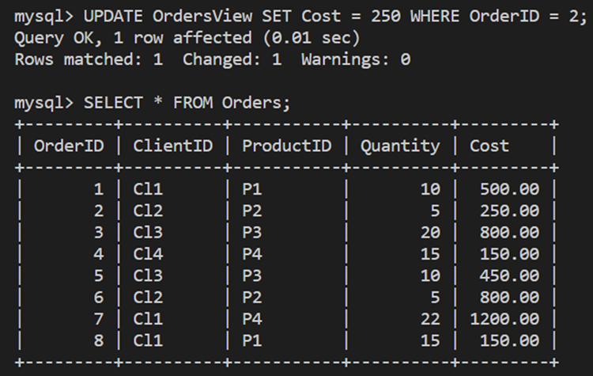

# Virtual tables in depth

## What is a VIEW in SQL? 

In SQL, a VIEW acts as a virtual table that utilizes data stored in existing tables in the database. The virtual table does not store any data itself. Instead, it acts as an interface that provides access to existing data.

&nbsp;

## Why do you need to use virtual tables?

You have a database with a base table with 7 columns named: column 1, column 2, column 3, column 4, column 5, column 6 and column 7. 

However, you are only interested in viewing and analyzing information in columns 3, column 4 and column 5. In this case, you can create a virtual table that contains the three required columns. This virtual table utilizes the data that exists in the corresponding columns in the base table, as presented in the following illustration. 



&nbsp;

In this case, all data in the base table could be treated as part of the virtual table. Though physically, they are stored in the base table, not the virtual table.

Along this line, there are several benefits to using virtual tables instead of base tables. These include simplifying access to data, manipulating data and providing security.

Let's explore these benefits in more detail. 

&nbsp;

## Simplifying access to data 

You can use virtual tables to simplify how users query and access data in the database. For example, Lucky Shrub keeps information in their database about clients, staff, products and orders. 

Lucky Shrub managers want to display the clients' ID, name and location from the Clients table and the orders they placed, including Order ID, Quantity and Cost from the Orders table. 

The managers want to display all of this data in one view without typing complicated queries every time they access this data. 

To help the managers, you can create a virtual table from the two tables, the clients and the orders. To do this, you can combine the client's ID, name and location from the Clients table with the Order ID, Quantity and Cost from the Orders table.

&nbsp;

## Manipulating data in the base table  

The virtual table allows you to manipulate, filter, and even update data in the base table if necessary. 

For example, the Orders table below shows information about the Order ID, Client ID, Product ID, Quantity and Cost: 



&nbsp;

The following virtual table, “OrdersView,” has been created from the Orders table using only three required columns.       



&nbsp;

Lucky Shrub need to change the cost of the second record (order id = 2) to 250. You can make this change directly in the virtual table. Simply use the following SQL UPDATE statement: 

```sql
UPDATE OrdersView SET Cost = 250 WHERE OrderID = 2;
```

This updates the cost for order id = 2 in the Orders base table, as shown below. 



&nbsp;

## Virtual tables support database security

When you design virtual tables, you create interfaces for users to access relevant data in your database, similarly to the base tables. However, with the virtual tables, you can only show the required data and hide what is not needed (including data that you do not want the users to have access to). 

In the previous example, you created a virtual table called "OrdersView" from the Orders table with information about the orders ID, quantity and cost only. This restricts the users from viewing specific columns. They only view what you want them to view. In this case, users will not be able to read information about client and product IDs. This may be sensitive information you need to hide from other database users. 

&nbsp;

(source: [Database Structures and Management with MySQL](https://www.coursera.org/learn/database-structures-and-management-with-mysql/))