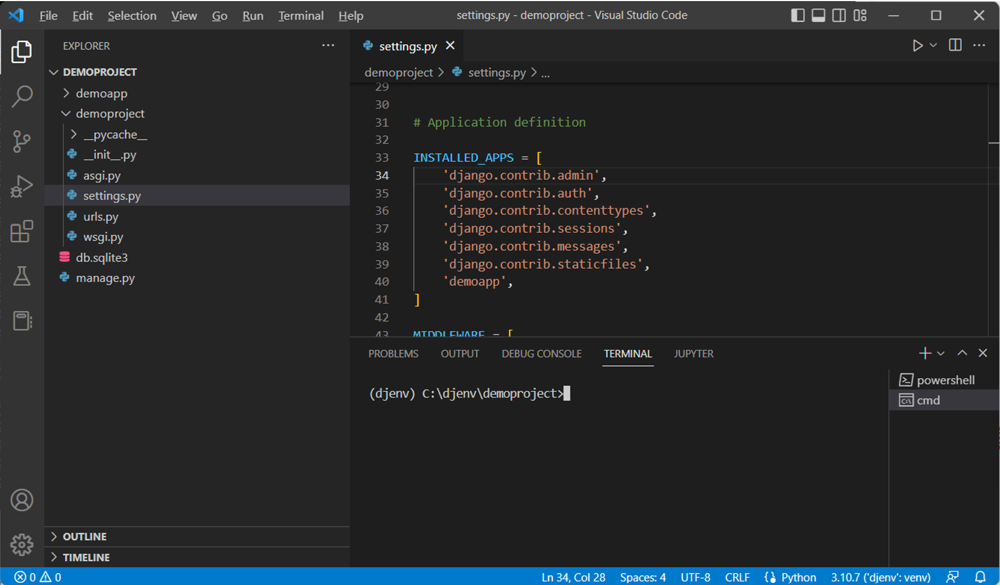
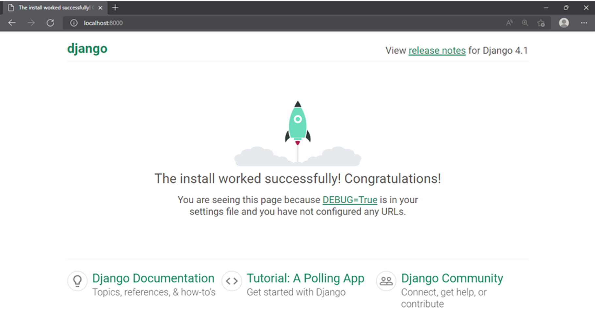

# Project Structure

When installing Django globally or in a virtual environment, Python recommends using isolated environment libraries and other dependencies required for a particular application.

Python's standard library contains the ```venv``` module. 

It installs a command-line utility called Django-admin in the system path and is located in the scripts folder of your current Python environment.

As the name suggests, you use the ```django-admin``` utility to perform various administrative tasks. 

These tasks include creating the project and app, performing ```migrations``` to generate database tables, whose structure matches data models, and running a development server.

## What is a project?

When you set out to build a modular, extensible and scalable web application, you need an arrangement that controls the standard features of its various sub-modules.

A Django project is a Python package containing the database configuration used by various sub-modules (Django calls them apps) and other Django-specific settings.

Use the ```startproject``` command of Django-admin as follows:  

```bash
(djenv) C:\djenv>django-admin startproject demoproject 
```

The ```startproject``` is Django’s default project template. It creates the following file structure in the Python environment:   

```bash
C:\djenv\demoproject 
│   manage.py 
│ 
└───demoproject 
        asgi.py 
        settings.py 
        urls.py 
        wsgi.py 
        __init__.py 
```

If you start VS Code in this folder, the file structure appears in its explorer as shown:



&nbsp;

You can see a folder named ```demoproject``` is created in the Python environment folder. 

It contains a script ```manage.py``` and another folder of the same name. 

You will learn more about the files in the inner folder later.

The ```manage.py``` script inside the outer ```demoproject``` has the same role as the ```django-admin``` utility. 

You can use it to perform various administrative tasks. In that sense, it is a local copy of the ```django-admin``` utility.

## manage.py

As mentioned above, the manage.py script can perform everything that the ```django-admin``` utility does. However, using ```manage.py``` is more straightforward, especially if you are required to work on a single project. 

If you have multiple projects, use ```django-adminand``` specify the settings. 

The general usage of ```manage.py``` is as follows: 

```bash
python manage.py <command>
```

Let's explore some of the required command options:

### startapp

As mentioned above, a Django project folder can contain one or more apps. An app is also represented by a folder of a specific file system. The command to create an app is: 

```bash
python manage.py startapp <name of app>
```

You will explore the structure of an app later. 

### makemigrations

Django manages the database operations with the ORM technique. Migration refers to generating a database table whose structure matches the data model declared in the app. 

The following command should be run whenever a new model is declared. 

```bash
python manage.py makemigrations
```

### migrate

This command option of manage.py synchronizes the database state with the currently declared models and migrations. 

```bash
python manage.py migrate
```

### runserver

This command starts Django’s built-in development server on the local machine with IP address 127.0.0.1 and port 8000.  

```bash
python manage.py runserver
```
It helps if you don't use this development server in the production environment. 

### Shell

This command opens up an interactive Python shell inside the project. This is useful when you are required to perform some quick interactive operations. 

```bash
python manage.py shell
```

Django prefers IPython if it is installed over the standard Python shell. 

## Project package

The ```startproject``` command option of the Django-admin utility creates the folder of the given name, inside which there is another folder of the same name. For example, the command:

```bash
django-admin startproject demoproject
```

This creates a ```demoproject``` folder, inside which there’s another ```demoproject``` folder.

The inner folder is a Python package. For a folder to be recognized by Python as a package, it must have a file ```__init__.py```. In addition, the ```startproject``` template places four more files in the package folder.

### settings.py

Django configures specific parameters with their default values and puts them in this file. 

The django-admin utility and ```manage.py``` script use these settings while performing various administrative tasks.


### urls.py

This script contains a list of object ```urlpatterns```. Every time the client browser requests a URL, the Django server looks to match its pattern and routes the application to the mapped view. 

The default structure of urls.py contains a view mapped to the project’s Admin site.

```python
from django.contrib import admin 
from django.urls import path 

 urlpatterns = [ 
    path('admin/', admin.site.urls), 
] 
```

### asgi.py

This file is used by the application servers following the ASGI standard to serve asynchronous web applications.

### wsgi.py

Many web application servers implement the WSGI standard. This script is the entry point for such WSGI-compatible servers to serve your classical web application. 

## settings.py

This file defines the attributes that influence the function of a Django application. The ```startproject``` template assigns some default values to these attributes. They may be modified as per requirement during the use of the application.

Let us explain some critical settings.

### INSTALLED_APPS

This is a list of strings. Each string represents the path of an app inside the parent project folder. The startproject template installs some apps by default. They appear in the ```INSTALLED_APPS``` list.

```python
INSTALLED_APPS = [ 
    'django.contrib.admin', 
    'django.contrib.auth', 
    'django.contrib.contenttypes', 
    'django.contrib.sessions', 
    'django.contrib.messages', 
    'django.contrib.staticfiles', 
] 
```

This list must be updated by adding its name whenever a new app is installed. 

For example, if we create a ```demoapp``` with the following command:

```bash
python manage.py startapp demoapp
```

Then, add the ```demoapp``` string inside the ```INSTALLED_APP``` list.

## Databases

This attribute is a dictionary that specifies the configuration of one or more databases to be used by the current Django application. By default, Django uses the SQLite database. Hence, this setting has a pre-defined configuration for it.

```python
DATABASES = { 
    'default': { 
        'ENGINE': 'django.db.backends.sqlite3', 
        'NAME': BASE_DIR / 'db.sqlite3', 
    } 
} 
```

The default name of the SQLite database is db.sqlite3, which is created in the parent project folder. 

In place of SQLite, you may choose to use any other. For example, for MySQL, the database settings could be as follows:

```python
DATABASES = {   
    'default': {   
        'ENGINE': 'django.db.backends.mysql',   
        'NAME': 'djangotest',   
        'USER': 'root',   
        'PASSWORD': 'password',   
        'HOST': '127.0.0.1',   
        'PORT': '3306',            
    }   
} 
```
Note here the default port number for MySQL is ```3306``` as against the default port number ```8000``` used with SQLite in Django. 

### DEBUG = True

By default, the development server runs in debug mode. This helps develop the application as the server picks up changes in the code and the output can be refreshed without restarting. However, it must be disabled in the production environment.

### ALLOWED HOSTS

This attribute is a list of strings. By default, it is empty. Each string represents the fully qualified host/domain where this Django site can be served. For example, to make the site running on localhost externally visible, you may add 0.0.0.0:8000 to this list.

### ROOT_URLCONF

This setting is a string pointing toward the urls.py module in which the project’s URL patterns are found. In this case, it would be:

```python
ROOT_URLCONF = 'demoproject.urls'
```

### STATIC_URL

This setting points to the folder where the static files, such as JavaScript code, CSS files and images, are placed. Usually, it is set to ```static/``` corresponding to the folder of this name in the parent project folder.

## Test the installation

After creating the project, to verify that it is built correctly, start the development server with the following command while remaining in the project’s parent folder:

```bash
python manage.py runserver
```

The server starts running at port 8000 of the localhost with IP address 127.0.0.1. Open the browser and enter http://127.0.0.1:8000/.   



&nbsp;

If you get this output, the project has been created successfully.

In this reading, you learned how to create a Django project. The file structure of the project has also been explained here. In the end, the installation of the project has been successfully verified.

&nbsp;

(source: [Django Web Framework](https://www.coursera.org/learn/django-web-framework/))