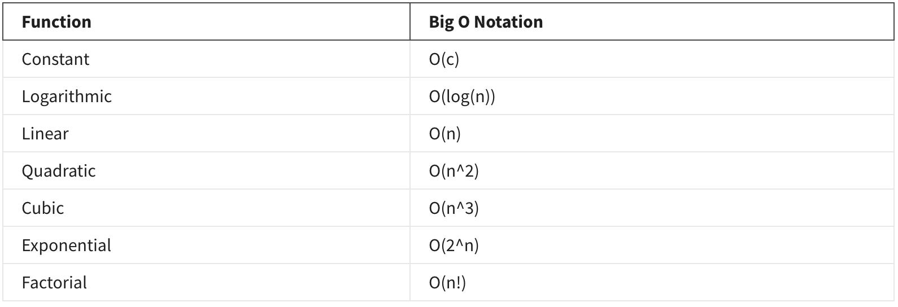

# Intro to Big-O notation

## Big-O

Everything we do needs to be measured. Why you might ask? To make something better you need a metric to start from. If a car company needs to make a faster car they need to know the top speed of the existing car to improve on it. In computer science, Big-O notation is the most fundamental tool to measure the cost of an algorithm. It describes the complexity of the code using algebraic terms.

&nbsp;

## Algorithmic complexity

Algorithmic complexity is a measure of how long an algorithm will take to complete given the size of the input, or what is commonly called n or n times. The n represents the number of elements.  Algorithm complexity can be divided into two types:

- Time complexity

- Space complexity

In computer science, time refers to how long an algorithm takes to complete. Space complexity refers to the amount of memory needed to complete the algorithm. When an algorithm is created by a programmer they also need to consider these two critical measures so that the program runs efficiently. You can measure the efficiency by using a concept called Big-O Notation. The below table showcases the fastest to slowest of these different categories:

&nbsp;

&nbsp;

## Why does it matter?

You might be wondering why you as a developer need to know about Big O and the importance of applying and understanding it. Badly written code is costly in today's world of scalable solutions. Optimized code has many benefits. For one, it will ensure your user experience is delivered to the highest standard. Faster code means a better experience from a user's perspective. No one likes looking at a spinner on-screen while they wait for items to load.

&nbsp;

(source: [Programming in Python](https://www.coursera.org/learn/programming-in-python/))