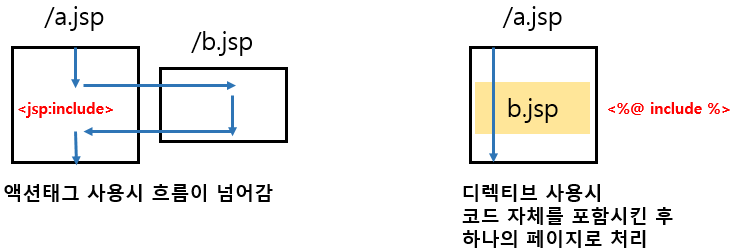

# 액션 태그

화면이 점차 복잡해지면서 디자이너들은 상황에 따라 HTML 태그에 자바 코드를 같이 써야 하는 문제로 어려움을 겪게 되었습니다. 따라서 JSP는 Scriptlet의 자바 코드를 제거하고 디자이너 입장에서 더 쉽고 편리하게 작업할 수 있는 태그 형태로 기능을 제공하게 되었고, 다음과 같은 액션 태그들로 자바 코드를 대신하게 되었습니다.

|이름 | 형식 | 설명 |
|:---:|:---:|:---:|
|인클루드 액션 태그 | \<jsp:include\>| 이미 있는 JSP를 현재 JSP에 포함하는 태그|
| 포워드 액션 태그 | \<jsp:forward\> | 서블릿에서 RequestDispatche 클래스의 포워딩 기능을 대신하는 태그 |
| 유즈빈 액션 태그 | \<jsp:useBean\> | 객체를 생성하기 위한 new 연산자를 대신하는 태그 |
| 셋프로퍼티 액션 태그 | \<jsp:setProperty\> | setter를 대신하는 태그 |
| 겟프로퍼티 액션 태그 | \<jsp:getProperty\> | getter를 대신하는 태그 |

&nbsp;

## Include Action Tag

Include action tag는 Include directive tag처럼 화면을 분할해서 관리할 때 사용합니다. Include action tag의 형식은 다음과 같습니다.

```jsp
<jsp:include page="jsp페이지" flush="true 또는 false">
...
</jsp:include>
```

&nbsp;

### Include Action Tag와 Include Directive Tag 비교

|항목|include action tag| include directive tag|
|:---:|:---:|:---:|
|기능|JSP 레이아웃 모듈화|JSP 레이아웃 모듈화|
|처리 시간|요청 시간에 처리|JSP를 자바 코드로 변환 시 처리|
|데이터 처리 방법|param 액션 태그를 이용해 동적 처리 가능|정적 처리만 가능|
|포함된 JSP 자바 파일 변환 여부| 포함되는 JSP가 각각 자바 파일로 생성|포함되는 JSP가 포함하는 JSP에 합쳐진 후 한 개의 자바 파일로 생성|

&nbsp;

### Include Action Tag 실행 과정

&nbsp;



&nbsp;

1. 브라우저 요청 시 JSP 파일을 컴파일
2. 컴파일 시 \<jsp:include\>가 지시하는 JSP를 요청
3. 요청된 JSP를 컴파일
4. 컴파일된 JSP가 응답을 보냄
5. JSP는 브라우저에서 요청한 응답 결과를 출력

&nbsp;

## Forward Action Tag

서블릿에서 다른 서블릿으로 포워딩하는 방법에 RequestDispatcher를 이용하는 방법이 있습니다. 하지만 포워드 액션 태그를 사용하면 자바 코드 없이도 포워딩할 수 있습니다. 또한 포워딩 시 다른 서블릿이나 JSP로 값을 전달할 수도 있습니다.

포워드 액션 태그의 형식은 다음과 같습니다.
```jsp
<jsp:forward page="포워딩할 JSP 페이지">
...
</jsp:forward>
```

&nbsp;

## useBean Action Tag

useBean action tag는 JSP페이지에서 자바 빈을 대체하기 위한 태그로, 사용 형식은 다음과 같습니다.

```jsp
<jsp:useBean id="빈 이름" class="패키지 이름을 포함한 자바 빈 클래스 [scope="접근범위"]/>
```

여기서 id는 JSP 페이지에서 자바 빈 객체에 접근할 때 사용하는 이름을 의미합니다. class는 패키지 이름을 포함한 자바 빈 이름을, scope는 자바 빈에 대한 접근 범위를 지정하는 역할을 합니다.

&nbsp;

## setProperty/getProperty Action Tag

|이름|정의|형식|
|---|---|---|
|setProperty|useBean의 속성에 값을 설정하는 태그|\<jsp:setProperty name="빈 이름" property="속성 이름" value="속성 값"/> <br />  - name: \<jsp:useBean> 액션 태그의 id 속성에 지정한 이름 <br /> - property: 값을 설정할 속성 이름 <br /> - value: 속성에 설정할 속성 값|
|getProperty|useBean의 속성 값을 가져옴|\<jsp:getProperty name="빈 이름" property="속성 이름"/> <br /> - name: \<jsp:useBean> 액션 태그의 id 속성에 지정한 이름 <br /> - property: 값을 얻을 속성 이름  |

&nbsp;

Excerpt From <자바 웹을 다루는 기술> by 이병승
