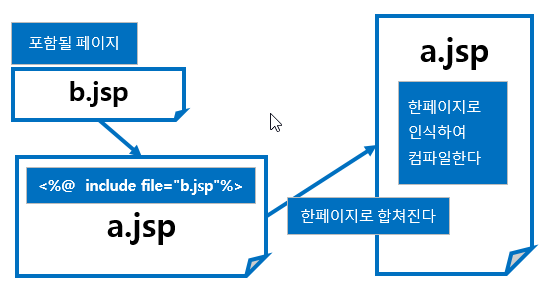

# JSP 페이지 구성 요소

JSP 페이지에서 사용되는 여러 가지 구성 요소들은 다음과 같습니다.

- Directive Tag
- Scripting Element: 주석문, 스크립트릿, 표현식, 선언식
- Expression Language
- 내장 객체(내장 변수)
- Action Tag
- Custom Tag

&nbsp;

## 디렉티브 태그

디렉티브 태그는 주로 JSP 페이지에 대한 전반적인 설정 정보를 지정할 때 사용하는 태그입니다.

- Page Directive Tag: JSP 페이지의 전반적인 정보를 설정할 때 사용합니다
- Include Directive Tage: 공통으로 사용하는 JSP 페이지를 다른 JSP 페이지에 추가할 때 사용합니다.
- Taglib Directive Tag: 개발자나 프레임워크에서 제공하는 태그를 사용할 때 사용합니다.

### Page Directive Tag

서블릿에서는 필요한 클래스 파일은 import 문을 이용해서 일일이 설정해 주었습니다. 하지만 이제 JSP 페이지에서 Page Directive Tag를 이용해서 설정합니다. 그리고 import 속성을 제외한 다른 속성은 한 번만 선언해 주어야 합니다.

페이지 디렉티브 형식은 다음과 같이 ```<%@page %>``` 안에 속성과 값을 나열하면 됩니다.

```jsp
<%@ page 속성1="값1" 속성2="값2" 속성3="값3" ... %>
```

### Include Directive Tag

JSP에서는 공통으로 사용되는 JSP 페이지를 미리 만들어 놓고 다른 JSP 페이지 요청 시 Include Directive Tag를 사용합니다. 그러면 재사용성이 높아질 뿐 아니라 유지관리도 수월해집니다.

Include Directive Tag 형식은 다음과 같습니다.

```jsp
<%@ include file="공통기능.jsp" %>
```

Include Directive Tag를 이용해 JSP 페이지를 요청하면 요청하는 JSP 페이지에 대해 실행하는 자바 파일은 단 한 개만 생성됩니다.



&nbsp;

Excerpt From <자바 웹을 다루는 기술> by 이병승
