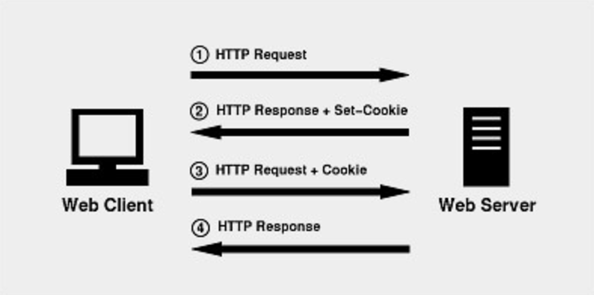

# 쿠키

쿠키(Cookie)란 웹 페이지들 사이의 공유 정보를 클라이언트 PC에 저장해 놓고 필요할 때 여러 웹 페이지들이 공유해서 사용할 수 있도록 매개 역할을 하는 방법입니다.

## 쿠키의 특징

- 정보가 클라이언트 PC에 저장
- 저장 정보 용량에 제한이 있습니다. (파일 용량은 4kb)
- 보안이 취약
- 클라이언트 브라우저에서 사용 유무를 설정할 수 있습니다.
- 도메인당 쿠키가 만들어집니다 (웹 사이트당 하나의 쿠키가 만들어집니다).

## 쿠키의 종류

| 속성 | Persistence 쿠키 | Session 쿠키 |
|:---:|:---:|:---:|
|생성 위치| 파일로 생성 | 브라우저 메모리에 생성 |
|종료 시기| 쿠키를 삭제하거나 쿠키 설정 값이 종료된 경우 | 브라우저를 종료한 경우 |
|최초 접속 시 전송 여부| 최초 접속 시 서버로 전송 | 최초 접속 시 서버로 전송되지 않음 |
|용도 | 로그인 유무 또는 팝업창을 제한할 때 | 사이트 접속 시 Session 인증 정보를 유지할 때 |

## 쿠키 기능 실행 과정

&nbsp;

&nbsp;

1. 브라우저로 사이트에 접속
2. 서버는 정보를 저장훈 쿠키를 생성
3. 생성된 쿠키를 브라우저로 전송
4. 브라우저는 서버로부터 받은 쿠키 정보를 쿠키 파일에 저장
5. 브라우저가 다시 접속해 서버가 브라우저에게 쿠키 전송을 요청하면 브라우저는 쿠키 정보를 서버에 넘겨줌
6. 서버는 쿠키 정보를 이용해 작업

## 쿠키 API 특징

- javax.servlet.http.Cookie를 이용한다.
- HttpServletResponse의 addCookie() 메서드를 이용해 클라이언트 브라우저에게 쿠키를 전송한 후 저장한다.
- HttpServletRequest의 getCookie() 메서드를 이용해 쿠키를 서버로 가져온다.

---

쿠키 생성시 setMaxAge() 메서드 인자 값의 종류를 지정해서 파일에 저장하는 Persistence 쿠키를 만들거나 메모리에만 저장하는 Session 쿠키를 만들 수 있습니다. 즉, setMaxAge() 메서드를 이용한 쿠키 저장 방식은 다음 두 가지로 나눌 수 있습니다.

- 인자 값으로 음수나 setMaxAge() 메서드를 사용하지 않고 쿠키를 만들면 Session 쿠키로 저장됩니다.
- 인자 값으로 양수를 사용하면 Persistence 쿠키로 저장됩니다.

&nbsp;

Excerpt From <자바 웹을 다루는 기술> by 이병승