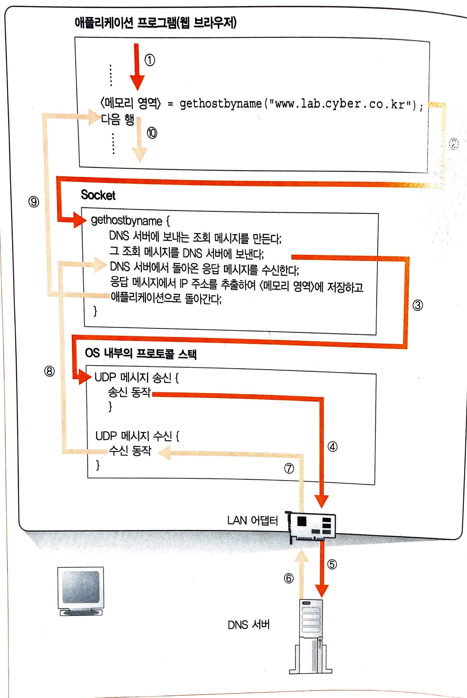

# DNS 리졸버

DNS 서버에 조회한다는 것은 DNS 서버에 조회 메시지를 보내고, 거기에 반송되는 응답 메시지를 받는다는 것입니다. 이것은 NDS 서버에 대해 클라이언트로 동작한다고도 말할 수 있습니다. 이 DNS 클라이언트에 해당하는 것은 DNS 리졸버 또는 단순히 리졸버라고 부릅니다. 그리고 DNS의 원리를 사용하여 IP 주소를 조사하는 것을 네임 리졸루션(name resolution)이라고 하는데, 이 리졸루션을 실행하는 것이 리졸버(resolver)입니다.

&nbsp;

## 리졸버 내부의 작동

&nbsp;

&nbsp;

애플리케이션 프로그램에 쓰여있는 작업 내용은 보통 위에서 아래로 실행됩니다.

1. 리졸버를 호출하는 부분에 이르러 해당 행을 실행하면 여기에서 애플리케이션의 동작이 일시적으로 정지합니다. 
2. Socket 라이브러리의 내용에 있는 리졸버가 움직이기 시작하여 애플리케이션에서 의뢰받은 작업을 실행합니다.
3. 리졸버에 제어가 넘어가면 여기에서 DNS 서버에 문의하기 위한 메시지를 만듭니다. 
4. 리졸버가 프로토콜 스택을 호출하면 제어가 리졸버에게 넘어가고 여기에서 메시지를 보내는 동작을 실행하여 LAN 어댑터를 통해 메시지가 DNS 서버를 향해 송신됩니다. (메시지 송신 동작은 리졸버가 스스로 실행하는 것이 아니라 OS의 내부에 포함된 프로토콜 스택을 호추랗여 실행을 의뢰합니다.)
5. 액세스 대상의 웹 서버가 DNS 서버에 등록되어 있으면 답이 발견되므로 답을 응답 메시지에 써서 클라이언트에게 반송합니다.
6. 메시지는 네트워크를 통해 클라이언트측에 도착하고, 프로토콜 스택을 경유하여 리졸버에 건네집니다.
7. 리졸버가 내용을 해독한 후 여기에서 IP 주소를 추출하여 애플리케이션에 IP 주소를 건네줍니다. 

&nbsp;

&nbsp;

Excerpt From <성공과 실패를 결정하는 1%의 네트워크 원리> by Tsutomu Tone