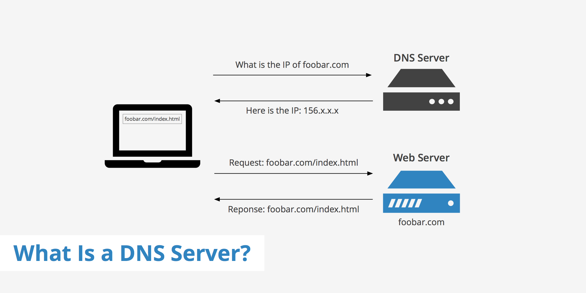
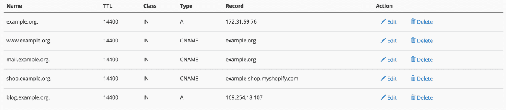
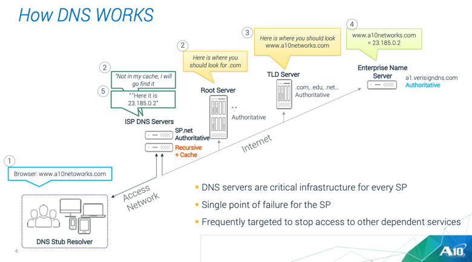

# DNS 서버

## DNS 서버의 기본 동작

DNS 서버의 기본 동작은 클라이언트에서 조회 메시지를 받고 조회의 내용에 응답하는 형태로 정보를 회답하는 일입니다. 

&nbsp;

&nbsp;

### 조회 메시지

1. 이름
    > 서버나 메일 배송 목적지(메일 주소에서 @ 뒷부분의 이름)와 같은 이름
2. 클래스
    > DNS 구조를 고안했을 때 인터넷 이외에도 네트워크에서의 이용까지 검토하여 이것을 식별하기 위해 클래스라는 정보를 준비했습니다. 그러나 지금은 인터넷 이외의 네트워크는 소멸되었으므로 클래스는 항상 인터넷을 나타내는 'IN'이라는 값이 됩니다.
3. 타입
    > 이름에 어떤 타입의 정보가 지원되는지를 나타냅니다. 예를 들어 타입이 A이면 이름에 IP 주소가 지원되는 것을 나타내며, MX이면 이름에 메일 배송 목적지가 지원된다는 것을 나타냅니다. 또한 이 타입에 따라 클라이언트에 회답하는 정보의 내용이 달라집니다. 

&nbsp;

&nbsp;

DNS 서버에서는 이들 세 가지 정보에 대응하여 클라이언트에 회답하는 항목을 등록해 두었습니다. 

&nbsp;

## 도메인의 계층

DNS 서버에 등록한 정보에는 모든 도메인명이라는 계층적 구조를 가진 이름이 붙여져 있습니다. 

계층화된 도메인의 정보를 서버에 등록하는데, 이때 하나의 도메인을 일괄적으로 취급합니다. 즉 한 개의 도메인 정보를 일괄적으로 DNS 서버에 등록하고 도메인 한 대의 정보를 분할하여 복수의 DNS 서버에 등록하는 것은 불가능합니다. 단 DNS 서버와 도메인은 항상 1대 1이 아니라 한 대의 DNS 서버에 복수 도메인의 정보를 등록할 수 있습니다.

예를 들어 www.cyber.co.kr이라는 도메인을 살펴볼까요? 최상위의 kr라는 도메인은 대한민국에 할당된 도메인입니다. 그리고 하위에 있는 co라는 도메인은 국내의 도메인을 분류하기 위해 설치된 도메인이며 회사를 나타냅니다. 그 아래에 있는 cybe가 회사에 할당된 도메인이며, 최하위의 www가 서버의 이름입니다.

&nbsp;

## 담당 DNS 서버를 찾아 IP 주소를 가져온다

하위의 도메인을 담당하는 DNS 서버의 IP 주소를 그 상위의 DNS 서버에 등록합니다. 그리고 상위의 DNS 서버를 또 그 상위의 DNS 서버에 등록합니다. 즉, lab.glasscom.com이라는 도메인을 담당하는 DNS 서버를 glasscom.com의 DNS 서버에 등록하고, glasscom.com의 DNS 서버를 com 도메인의 DNS 서버에 등록하는 식입니다. 이렇게 하면서 상위의 DNS 서버에 가면 하위의 DNS 서버의 IP 주소를 알 수 있고, 거기에서 조회 메시지를 보낼 수 있습니다.

위의 설명에서는 com이나 kr라는 도메인의 DNS 서버에 하위의 DNS 서버를 등록하는 것에서 끝나는 것처럼 보이지만, 사실은 그렇지 않습니다. 인터넷의 도메인은 com이나 kr의 상위에 또 하나의 **루트 도메인**이라는 도메인이 있습니다. 루트 도메인에는 com이나 jp라는 도메인명이 없으므로 보통 도메인을 쓸 때는 그것을 생략합니다. 하지만 루트 도메인을 명시적으로 써야 하는 경우에는 www.lab.glasscom.com. 처럼 끝에 마침표를 찍어서 루트 도메인을 나타내지만, 보통은 그렇게 쓰지 않으므로 루트 도메인의 존재를 알아차리지 못합니다. 이 경우 루트 도메인이 존재하므로 DNS 서버에 com이나 co의 DNS 서버를 등록합니다. 이렇게 해서 하위의 DNS 서버를 상위의 DNS 서버에 등록하여 루트 도메인에서 차례대로 아래쪽으로 거슬러 내려갈 수 있습니다.

등록 작업은 한 가지가 더 있습니다. 루트 도메인의 DNS 서버를 인터넷에 존재하는 DNS 서버에 전부 등록하는 것입니다. 이렇게 해서 어느 DNS 서버에도 루트 도메인에 액세스할 수 있게 됩니다. 그 결과, 클라이언트에서 어딘가의 DNS 서버에 액세스하면 여기에서부터 루트 도메인을 경유하여 도메인의 계층 아래로 찾아가서 최종적으로 원하는 DNS 서버에 도착합니다.

루트 도메인의 DNS 서버에 할당된 IP 주소는 전 세계에 13개 밖에 없고 좀처럼 변경되지 않으므로 이것을 각 DNS 서버에 등록하는 작업은 어렵지 않습니다. 

&nbsp;

&nbsp;

## DNS 서버는 캐시 기능으로 빠르게 회답할 수 있다

현실에서는 상위와 하위의 도메인을 같은 DNS 서버에 등록하는 경우도 있습니다. 이 경우 상위의 DNS 서버에 조회하면 하위의 DNS 서버를 한 개 건너뛰고, 다시 그 아래의 DNS 서버에 관한 정보가 돌아옵니다. 

최상위 루트 도메인에서 차례대로 따라간다는 원칙대로 움직이지 않을 수도 있습니다. DNS 서버는 한 번 조사한 이름을 캐시에 기록할 수 있는데, 조회한 이름에 해당하는 정보가 캐시에 있으면 그 정보를 회답하기 때문입니다. 그러면 그 위치에서 계층 구조를 아래로 향하여 찾을 수 있습니다.

조회한 이름이 도메인에 등록되어 있지 않은 경우에는 이름이 존재하지 않는다는 회답이 돌아오지만, 그것을 캐시에 보존할 수도 있습니다. 이렇게 해서 이름이 존재하지 않는 경우에도 빠르게 회답할 수 있습니다.

캐시에 정보를 저장한 후 등록 정보가 변경되는 경우도 있으므로 캐시 안에 저장된 정보는 올바르다고 단언할 수 없습니다. 따라서 DNS 서버에 등록하는 정보에는 유효 기한을 설정하고, 캐시에 저장한 데이터의 유효 기간이 지나면 캐시에서 삭제합니다. 또한 조회에 회답할 때 정보가 캐시에 저장된 것인지, 아니면 등록처 DNS 서버에서 회다한 것인지 알려줍니다.

&nbsp;

Excerpt From <성공과 실패를 결정하는 1%의 네트워크 원리> by Tsutomu Tone