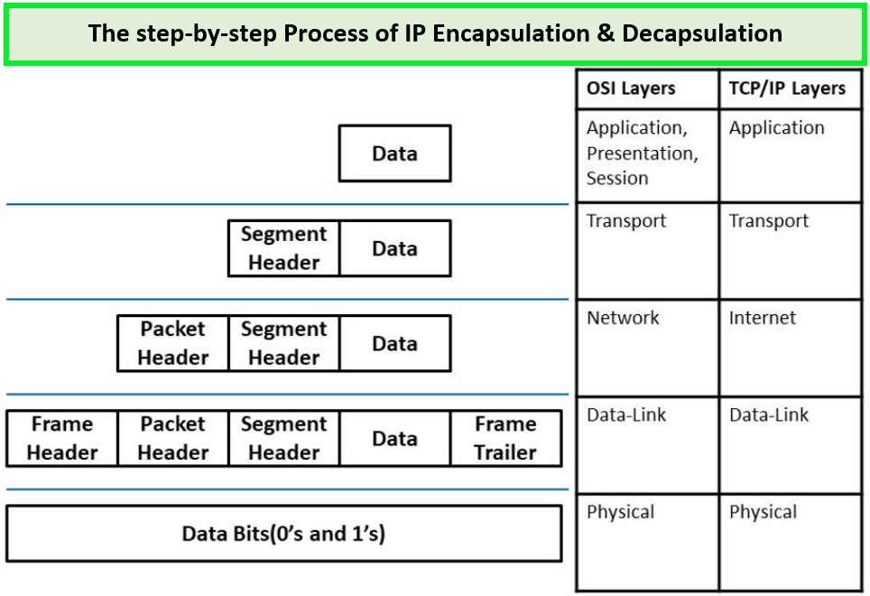

# 인캡슐레이션과 디캡슐레이션

&nbsp;

&nbsp;

애플리케이션에서 데이터를 data flow layer(1~4계층)으로 내려보내면서 패킷에 데이터를 넣을 수 있도록 분할하는데 이 과정을 인캡슐레이션이라고 부릅니다. 네트워크 상황을 고려해 적절한 크기로 데이터를 쪼개고 위 그림과 같이 4계층부터 네트워크 전송을 위한 정보를 헤더에 붙여 넣습니다. 헤더 정보는 4계층, 3계층, 2계층에서 각각 자신이 필요한 정보를 추가하는데 이 정보는 우리가 알 수 있는 문자가 아닌 미리 정의된 비트 단위로 씁니다. 

반대로 받는 쪽에서는 디캡슐레이션 과정을 수행합니다. 받은 전기 신호를 데이터 형태로 만들어 2계층으로 올려보냅니다. 2계층에서는 송신자가 작성한 2계층 헤더에 포함된 정보를 확인합니다. 만약 2계층에 적힌 정보 중 목적지가 자신이 아니라면 자신에게 온 패킷이 아니므로 버립니다. 반대로 2계층에 적힌 정보의 목적지가 자신이 맞다면 3계층으로 이 정보를 보내줍니다. 데이터를 상위 계층으로 올려보낼 때 2계층의 헤더 정보는 더 이상 필요없으므로 벗겨내고 올려보내 줍니다. 이 데이터를 받은 3계층에서는 2계층이 동작했던 것처럼 상대방이 적은 3계층의 헤더 정보를 확인해 자신에게 온 것이 맞는지 확인하고 맞으면 3계층 헤더 정보를 제거하고 4계층으로 보냅니다. 이를 받은 4계층도 3계층과 같은 과정을 거쳐 데이터를 애플리케이션으로 올려보내 줍니다.

이런 복잡한 작업은 2가지 정보 흐름으로 설명할 수 있습니다.

- 인캡슐레이션, 디캡슐레이션 과정을 통해 데이터가 전송되는 과정
- 각 계층 헤더를 이용해 송신자 계층과 수신자 계층 간의 논리적 통신 과정

데이터를 인캡슐레이션 하는 과정에서 헤더에 넣는 정보들이 꽤 많아 모두 이해하기는 힘듭니다. 하지만 이러한 복잡한 정보들에도 규칙이 있으며 헤더에 두 가지 정보는 반드시 포함되어야 합니다.

1. 현재 계층에서 정의하는 정보
2. 상위 프로토콜 지시자

현재 계층에서 정의하는 정보는 OSI 7계층의 각 계층에서의 목적에 맞는 정보들이 포함됩니다. 그렇다면 2번 상위 프로토콜 지시자는 왜 필요할까요?

프로토콜 스택은 상위 계층으로 올라갈수록 종류가 많아집니다. 3계층 프로토콜인 IP는 4계층에서는 다시 TCP와 UDP로 나뉘고 그보다 더 상위 계층에서는 FTP, HTTP, SMTP,POP3 등 더 다양한 프로토콜로 다시 나뉩니다.

&nbsp;

&nbsp;

인캡슐레이션 과정에서는 상위 프롵콜이 많아도 문제가 없지만 디캡슐레이션하는 목적지 쪽에서는 헤더에 아무 정보가 없으면 어떤 상위 프로토콜로 올려보내 주어야 할지 결정할 수 없습니다. 이런 문제가 발생하지 않도록 인캡슐레이션하는 쪽에서는 헤더에 상위 프로토콜 지시자 정보를 포함해야 합니다. 

각 계층마다 이 상위 프로토콜 지시자를 가지고 있지만 이름이 달라 4계층은 포트 번호, 3계층은 프로토콜 번호, 2계층은 이더 타입이라고 부릅니다. 이 정보들에 대해 착각하기 쉬운 것은 포트 번호는 4계층 헤더에 적힌 정보이지만 애플리케이션 계층에서 프로토콜 종류를 나타내주는 정보라는 것입니다. 디캡슐레이션할 때 상위 프로토콜 지시자 정보를 이용해 어느 상위 계층 프로토콜로 보내야 할지 구분해야 하므로 동작하는 계층보다 한 계층 위의 정보가 적혀 있게 됩니다.

&nbsp;

Excerpt From <IT 엔지니어를 위한 네트워크 입문> by 고재성, 이상훈
