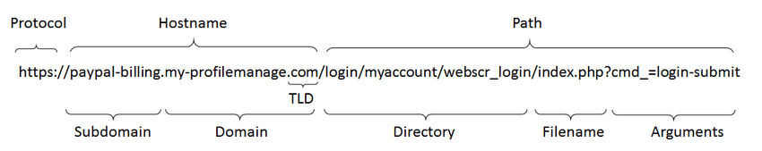
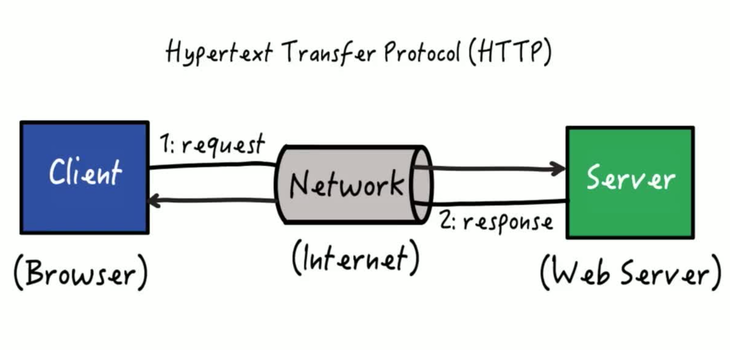

# HTTP 기본 개념

&nbsp;

위의 그림처럼 URL(Uniform Resource Locator)을 해독하면 어디에 액세스해야 하는지가 판명됩니다.그러고 나면 브라우저는 HTTP 프로토콜을 사용하여 웹 서버에 액세스하는데, 그 동작을 살펴보기 전에 먼저 HTTP 프로토콜이 무엇인지 알아봅시다.

&nbsp;

## HTTP 프로토콜

&nbsp;

&nbsp;

HTTP 프로토콜은 클라이언트와 서버가 주고받는 메시지의 내용이나 순서를 정한 것이지만, 기본적인 개념은 단순합니다. 먼저 클라이언트에서 서버를 향해 리퀘스트 메시지를 보냅니다. 리퀘스트 메시지의 안에는 '무엇을', '어떻게 해서' 하겠다는 내용이 쓰여있습니다.

'무엇을'에 해당하는 것을 URI(Uniform Resource Identifier)라고 하는데, 보통 페이지 데이터를 저장한 파일의 이름이나 CGI 프로그램의 파일명은 URI로 씁니다. 예를 들어 'dir/page1.html'이나 '/dir1/program1.cgi'와 같은 식입니다. 여기에는 다양한 액세스 대상을 쓸 수 있으며, 이러한 액세스 대상을 통칭하는 말이 URI입니다.

'어떻게 해서'에 해당하는 것이 메소드로, 이 메소드에 의해 웹 서버에 어떤 동작을 하고 싶은지를 전달합니다.

리퀘스트 메시지가 웹 서버에 도착하면 웹 서버는 그 속에 쓰여있는 내용을 해독합니다. 그리고 URI와 메시지를 조사하여 '무엇을', '어떻게 하는지' 판단한 후 요구에 따라 동작하고, 결과 데이터를 응답 메시지에 저장합니다.

응답 메시지의 맨 앞 부분에는 실행 결과가 정상 종료되었는지 또 이상이 발생했는지를 나타내는 스테이터스 코드가 있습니다. 그 후 헤더 파일과 페이지의 데이터가 이어지고, 이 응답 메시지를 클라이언트에 반송합니다. 그러면 이것이 클라이언트에 도착하여 브라우저가 메시지의 안에서 데이터를 추출하여 화면에 표시하면서 HTTP의 동작은 끝납니다.

&nbsp;

Excerpt From <성공과 실패를 결정하는 1%의 네트워크 원리> by Tsutomu Tone