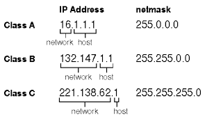

# IP 주소

## IP 주소 체계

우리가 흔히 사용하는 IP 주소는 32비트인 IPv4 주소입니다. IP는 v4, v6 두 체계가 사용되며 IPv6 주소는 128비트입니다.

IP 주소는 네트워크 주소와 호스트 주소 두 부분으로 나뉩니다.

- 네트워크 주소: 호스트들을 모은 네트워크를 지칭하는 주소. 네트워크 주소가 동일한 네트워크를 로컬 네트워크라고 함.
- 호스트 주소: 하나의 네트워크 내에 존재하는 호스트를 구분하기 위한 주소

IP 주소 부족과 낭비 문제를 해결하기 위해 3가지 보존, 전환전략을 만들어앴는데 그 중 첫 번째 단기 대책은 클래스리스, CIDR 기반의 주소 체계였습니다. 두 번째 중기 대책은 NAT와 사설IP 주소, 세 번째 장기 대책은 차세대 IP인 IPv6입니다.

&nbsp;

## 클래스리스 네트워크

클래스리스 네트워크에서는 별도로 네트워크와 호스트 주소를 나누는 구분자를 사용해야 하는데 이 구분자를 서브넷 마스크라고 부릅니다.

서브넷 마스크는 IP 주소와 네트워크 주소를 구분할 때 사용하는데 2진수 숫자 1은 네트워크 주소, 0은 호스트 주소로 표시합니다.

만약 103.9.32.146 주소에서 255.255.255.0 서브넷 마스크를 사용하는 IP는 네트워크 주소가 103.9.32.0이고 호스트 주소는 0.0.0.146이 됩니다. 서브넷 마스크가 2진수 1인 부분(10진수 255인 부분)은 IP 숫자가 그대로 연산 결과가 되고 서브넷 마스크가 0인 부분은 모두 0으로 변경됩니다.

&nbsp;

&nbsp;

## 공인 IP와 사설 IP

인터넷에 접속하려면 IP 주소가 있어야 하고 이 IP는 전 세계에서 유일해야 하는 식별자입니다. 이런 IP 주소를 공인 IP라고 합니다. 하지만 인터넷에 연결하지 않고 개인적으로 네트워크를 구성한다면 공인 IP 주소를 할당받지 않고도 네트워크를 구축할 수 있습니다. 이때 사용하는 IP 주소를 사설 IP 주소라고 합니다. 

&nbsp;

Excerpt From <IT 엔지니어를 위한 네트워크 입문> by 고재성, 이상훈

