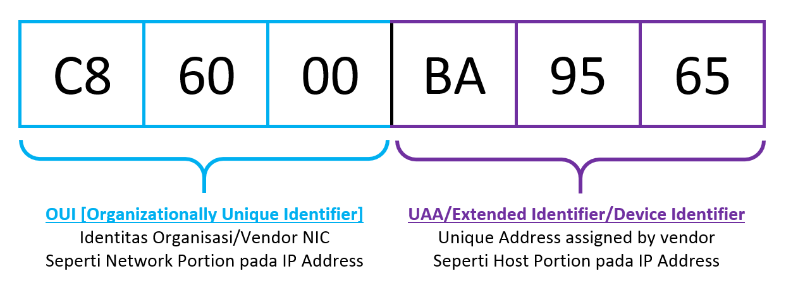

# MAC 주소

MAC 주소는 Media Access Control의 줄임말로 2계층(데이터 링크 계층)에서 통신을 위해 네트워크 인터페이스에 할당된 고유 식별자입니다. MAC 주소는 이더넷과 와이파이를 포함한 대부분의 IEEE 802 네트워크 기술에서 2계층 주소로 사용됩니다. 네트워크에 접속하는 모든 장비는 MAC 주소라는 물리적인 주소가 있어야 하고 이 주소를 이용해 서로 통신하게 됩니다.

&nbsp;

## MAC 주소 체계

MAC 주소는 48비트의 16진수 12자리로 표현됩니다. 48비트의 MAC 주소는 다디 다음과 같이 앞의 24비트와 뒤의 24비트로 나누어 구분하는데 '제조사 코드'가 MAC 주소 앞의 24비트인 'OUI' 값입니다. 뒤의 24비트의 값인 'UAA'는 각 제조사에서 자체적으로 할당하여 네트워크에서 각 장비를 구분할 수 있게 해줍니다.

&nbsp;

&nbsp;

## MAC 주소 동작

NIC은 자신의 MAC 주소를 가지고 있고 전기 신호가 들어오면 2계층에서 데이터 형태(패킷)로 변환하여 내용을 구분한 후 도착지 MAC 주소를 확인합니다. 만약 도착지 MAC 주소가 자신이 갖고 있는 MAC 주소와 다르면 그 패킷을 폐기합니다. 패킷의 목적지 주소가 자기 자신이거나 브로드캐스트, 멀티캐스트와 같은 그룹 주소이면 처리해야 할 주소로 인지해 패킷 정보를 상위 계층으로 넘겨줍니다.

도착지 주소가 일치하지 않아 NIC에서 자체적으로 패킷을 폐기하는 경우와 달리 본인의 주소, 브로드캐스트 주소는 NIC 자체적으로 패킷을 처리하는 것이 아니라 OS나 애플리케이션에서 처리해야 하므로 시스템에 부하가 작용합니다.

&nbsp;

Excerpt From <IT 엔지니어를 위한 네트워크 입문> by 고재성, 이상훈

