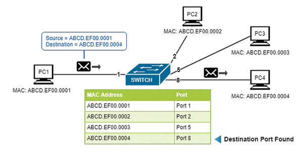
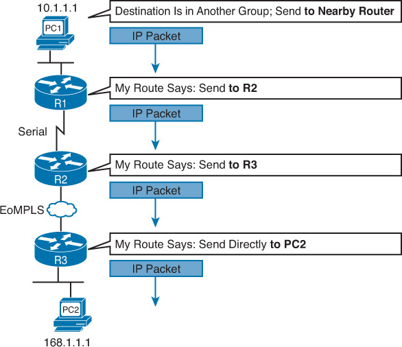
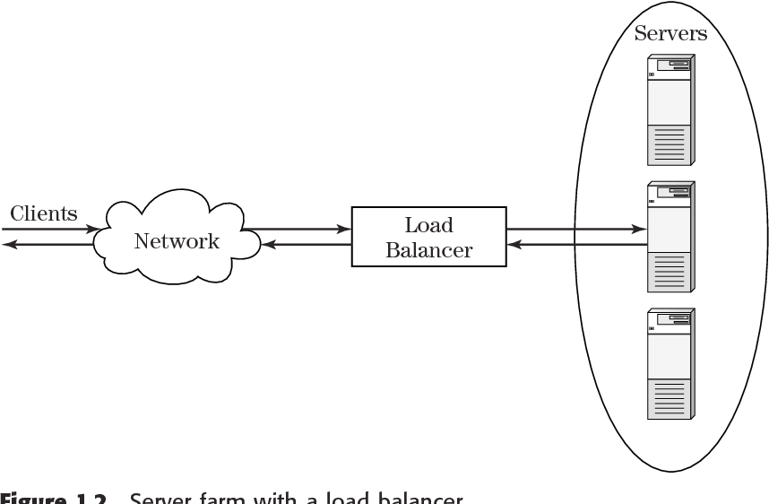

# OSI 7계층별 이해하기

OSI 7계층은 참조형 모델이고 실제로 사용하는 프로토콜은 TCP/IP 프로토콜 스택으로 구현되어 있지만 조금 더 계층별로 자세히 다루기 위해 여기서는 OSI 7계층을 기준으로 나누어 설명하겠습니다.

&nbsp;

&nbsp;

## 1계층 (피지컬 계층)

1계층은 물리 계층으로 물리적 연결과 관련된 정보를 정의합니다. 주로 전기 신호를 전달하는데 초점이 맞추어져 있습니다. 1계층의 주요 장비로는 허브, 리피터, 케이블, 커넥터, 트랜시버, 탭이 있습니다. 허브, 리피터는 네트워크 통신을 중재하는 네트워크 장비입니다. 케이블과 커넥터는 케이블 본체를 구성하는 요소이고, 트랜시버는 컴퓨터의 랜카드와 케이블을 연결하는 장비입니다. 탭은 네트워크 모니터링과 패킷 분석을 위해 전기 신호를 다른 장비로 복제해줍니다.

1계층에서는 들어온 전기 신호를 그대로 잘 전달하는 것이 목적이므로 전기 신호가 1계층 장비에 들어오면 이 전기 신호를 재생성하여 내보냅니다. 1계층 장비는 주소의 개념이 없으므로 전기 신호가 들어온 포트를 제외하고 모든 포트에 같은 전기 신호를 전송합니다.

&nbsp;

## 2계층 (데이터 링크 계층)

2계층은 데이터 링크 계층으로 전기 신호를 모아 우리가 알아볼 수 있는 데이터 형태로 처리합니다. 1계층과는 다르게 전기 신호를 정확히 전달하기보다는 주소 정보를 정의하고 정확한 주소로 통신이 되도록 하는 데 초점이 맞추어져 있습니다. 1계층에서는 전기 신호를 잘 보내는 것이 목적이므로 출발지와 목적지를 구분할 수 없지만 2계층에서는 출발지와 도착지 주소를 확인하고 내게 보낸 것이 맞는지, 또는 내가 처리해야 하는지에 대해 검사한 후 데이터 처리를 수행합니다.

2계층에서는 주소 체계가 생기면서 여러 통신이 한꺼번에 이루어지는 것을 구분하기 위한 기능이 주로 정의됩니다. 전기 신호를 모아 데이터 형태로 처리하므로 데이터에 대한 에러를 탐지하거나 고치는 역할을 수행할 수 있습니다. 신뢰할 수 있는 현대의 물리 계층과 달리 과거에는 신뢰할 수 없는 미디어를 이용해 통신하는 경우도 많아 2계층에서 에러를 탐지하고 고치거나 재전송했지만 이더넷 기반 네트워크의 2계층에서는 에러를 탐지하는 역할만 수행합니다. 주소 체계가 생긴다는 의미는 한 명과 통신하는 것이 아니라 동시에 여러 명과 통신할 수 있다는 것이므로 무작정 데이터를 던지는 것이 아니라 받는 사람이 현재 데이터를 받을 수 있는지 확인하는 작업부터 해야 합니다. 이 역할을 Flow Control이라고 부릅니다.

2계층에서 동작하는 네트워크 구성 요소는 네트워크 인터페이스 카드와 스위치입니다. 2계층의 가장 중요한 특징은 MAC 주소라는 주소 체계가 있다는 것입니다. 2계층에서 동작하는 네트워크 인터페이스 카드와 스위치 모두 MAC 주소를 이해할 수 있고 스위치는 MAC 주소를 보고 통신해야 할 포트를 지정해 내보내는 능력이 있습니다.

&nbsp;

&nbsp;

네트워크 인터페이스 카드에는 고유 MAC 주소가 있습니다. 입력되는 전기 신호를 데이터 형태로 만들고 데이터에서 도착지 MAC 주소를 확인한 후 자신에게 들어오는 전기 신호가 맞는지 확인합니다. 자신에게 들어오는 전기 신호가 아니면 버리고 자신에게 들어오는 전기 신호가 맞으면 이 데이터를 상위 계층에서 처리할 수 있도록 메모리에 적재합니다.

&nbsp;

&nbsp;

스위치는 단말(Terminal)이 어떤 MAC 주소인지, 연결된 포트는 어느 것인지 주소 습득 과정에서 알 수 있습니다. 이 데이터를 기반으로 단말들이 통신할 때 포트를 적절히 필터링하고 정확한 포트로 포워딩해줍니다. 반면, 1계층에서 동작하는 허브는 한 포트에서 전기 신호가 들어오면 전체 포트로 전기 신호를 전달하다 보니 전체 네트워크에서 동시에 오직 하나의 장비만 데이터를 보낼 수 있습니다. 스위치의 적절한 필터링과 포워딩 기능으로 통신이 필요한 포트만 사용하고 네트워크 전체에 불필요한 처리가 감소하면서 이더넷 네트워크 효율성이 크게 향상되었고 이더넷 기반 네트워크가 급증하는 계기가 되었습니다.

&nbsp;

## 3계층 (네트워크 계층)

3계층에서는 IP 주소와 같은 논리적인 주소가 정의됩니다. 데이터 통신을 할 때는 두 가지 주소가 사용되는데 2계층의 물리적인 MAC 주소와 3계층의 논리적인 IP 주소입니다. MAC 주소와 달리 IP 주소는 사용자가 환경에 맞게 변경해 사용할 수 있고 네트워크 주소 부분과 호스트 주소 부분으로 나뉩니다. 3계층 이해할 수 있는 장비나 단말은 네트워크 주소 정보를 이용해 자신이 속한 네트워크와 원격지 네트워크를 구분할 수 있고 원격지 네트워크를 가려면 어디로 가야 하는지 경로를 지정하는 능력이 있습니다.

3계층에서 동작하는 장비는 라우터입니다. 라우터는 3계층에서 정의한 IP 주소를 이해할 수 있습니다. 라우터는 IP 주소를 사용해 최적의 경로를 찾아주고 해당 경로로 패킷을 전송하는 역할을 합니다.

&nbsp;

&nbsp;

## 4계층 (트랜스포트 계층)

하위 계층인 1, 2, 3계층은 신호와 데이터를 올바른 위치로 보내고 실제 신호를 잘 만들어 보내는 데 집중합니다. 하지만 4계층은 실제로 해당 데이터들이 정상적으로 잘 보내지도록 확인하는 역할을 합니다. 패킷 네트워크는 데이터를 분할해 패킷을 실어보내다 보니 중간에 패킷이 유실되거나 순서가 바뀌는 경우가 생길 수 있습니다. 이 문제를 해결하기 위해 패킷이 유실되거나 순서가 바뀌었을 때 바로잡아 주는 역할을 4계층에서 담당합니다. 4계층에서 패킷을 분할할 때  패킷 헤더에 보내는 순서와 받는 순서를 적어 통신하므로 패킷이 유실되면 재전송을 요청할 수 있고 순서가 뒤바뀌더라도 바로잡을 수 있습니다. 패킷에 보내는 순서를 명시한 것이 시퀀스 번호이고 받는 순서를 나타낸 것이 ACK 번호입니다. 이뿐만 아니라 장치 내의 많은 애플리케이션을 구분할 수 있도록 포트 번호를 사용해 상위 애플리케이션을 구분합니다.

4계층에서 동작하는 장비로는 로드 밸런서와 방화벽이 있습니다. 이 장비들은 4계층에서 볼 수 있는 애플리케이션 구분자(포트 번호)와 시퀀스, ACK 번호 정보를 이용해 부하를 분산하거나 보안 정책을 수립해 패킷을 통과, 차단하는 기능을 수행합니다.

&nbsp;

&nbsp;

## 5계층 (세션 계층)

5계층인 세션 계층은 양 끝단의 응용 프로세스가 연결을 성립하도록 도와주고 연결이 안정적으로 유지되도록 관리하고 작업 완료 후에는 이 연결을 끊는 역할을 합니다. 흔히 우리가 부르는 "세션"을 관리하는 것이 주요 역할인 세션 계층은 TCP/IP 세션을 만들고 없애는 책임을 집니다. 또한, 에러로 중단된 통신에 대한 에러 복구와 재전송도 수행합니다.

&nbsp;

## 6계층 (프리젠테이션 계층)

6계층인 프레젠테이션 계층은 표현 방식이 다른 애플리케이션이나 시스템 간의 통신을 돕기 위해 하나의 통일된 구문 형식으로 변환시키는 기능을 수행합니다. 일종의 번역기나 변환기 역할을 수행하는 계층이고 이런 기능은 사용자 시스템의 응용 계층에서 데이터의 형식상 차이를 다루는 부담을 덜어줍니다. MIME 인코딩이나 암호화, 압축, 코드 변환과 같은 동작이 이 계층에서 이루어집니다.

&nbsp;

## 7계층 (응용 계층)

OSI 계층의 최상위 7계층인 애플리케이션 계층은 애플리케이션 프로세스를 정의하고 애플리케이션 서비스를 수행합니다. 네트워크 소프트웨어의 UI 부분이나 사용자 입출력 부분을 정의하는 것이 애플리케이션 계층의 역할입니다. 애플리케이션 계층의 프토로콜은 엄청나게 많은 종류가 있지만 대표적인 프로토콜로는 FTP, SMTP, HTTP, TELNET 등이 있습니다.

&nbsp;

Excerpt From <IT 엔지니어를 위한 네트워크 입문> by 고재성, 이상훈