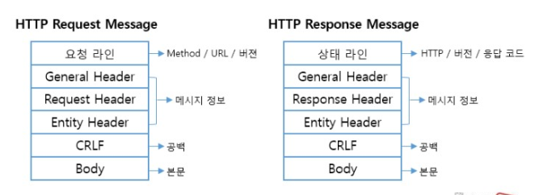

# HTTP Request & Response Message



&nbsp;

## Request Message

### Request Line

리퀘스트 메시지의 첫 번째 행에는 리퀘스트 라인을 작성합니다. 이 행에서 중요한 것은 맨 앞에 있는 메소드입니다. 이것을 통해 웹 브라우저는 웹 서버에 어떻게 할 것인지를 전달합니다.

메소드를 썼으면 한 칸 띄운 다음에 URI를 씁니다. URI 부분에는 다음과 같이 파일이나 프로그램의 경로명을 쓰는 것이 보통입니다.

```text
/<디렉토리명>/....../<파일명>
```

경로명은 보통 URL에 포함되어 있으므로 URL에서 경로명을  추출하여 복사합니다. 그리고 첫 번째 행의 끝에 메시지가 HTTP의 어느 버전 사양을 바탕으로 쓴 것인지를 나타내기 위해 버전 번호를 써서 첫 번째 행을 완료합니다.

### Message Header

두 번째 행부터는 메시지 헤더라는 행이 이어집니다. 첫 번째 해에서 리퀘스트의 내용을 대략 알 수 있지만, 부가적인 자세한 정보가 필요한 경우도 있는데, 이것을 써 두는 것이 메시지 헤더의 역할입니다.

### Message Body

메시지 헤더를 쓰면 그 뒤에 아무 것도 쓰지 않은 하나의 공백 행을 넣고, 그 뒤에 송신할 데이터를 씁니다. 이 부분을 메시지 본문이라 하며, 이것이 메시지의 실제 내용이 됩니다.

단 메소드가 GET인 경우에는 메소드와 URI만으로 웹 서버가 무엇을 할지 판단할 수 있으므로 메시지 본문에 쓰는 송신 데이터는 아무 것도 없습니다. 따라서 메시지 헤더가 끝난 곳에서 메시지는 끝납니다.

메시지가 POST인 경우에는 폼에 입력한 데이터 등을 메시지 본문 부분에 씁니다.

&nbsp;

## Response Message

응답 메시지의 포맷도 기본적인 개념은 리퀘스트 메시지와 같습니다. 단 첫 번째 행이 다릅니다.

응답의 경우는 정상 종료했는지, 아니면 오류가 발생했는지, 즉 리퀘스트의 실행 결과를 나타내는 스테이터스 코드와 응답 문구를 첫 번째 행에 써야 합니다. 이들 둘은 내용이 같지만 용도가 다릅니다. 스테이터스 코드는 숫자로 쓴 것이며, 주로 프로그램 등에 실행 결과를 알려주는 것이 목적입니다. 이에 비해 응답 문구쪽은 문장으로 쓰여 있으며 사람에게 실행 결과를 알리는 것이 목적입니다.

&nbsp;

Excerpt From <성공과 실패를 결정하는 1%의 네트워크 원리> by Tsutomu Tone