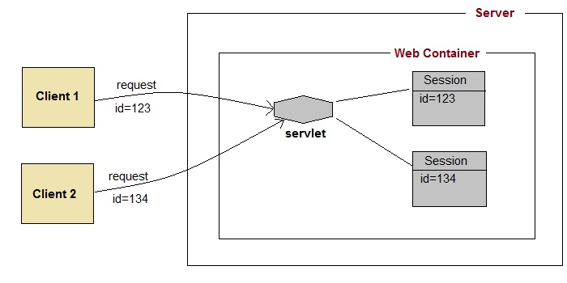

# Session

쿠키는 사용 시 웹페이지들의 정보가 클라이언트 PC에 저장되므로 정보가 쉽게 노출될 수 있다는 단점이 있는 반면, 세션은 서버의 메모리에 생성되어 정보를 저장합니다. 따라서 웹 페이지에서 사용되는 정보 중에 로그인 정보처럼 보안이 요구되는 정보는 대부분 세션을 이용합니다.

## Session 특징

- 정보가 서버의 메모리에 저장
- 브라우저의 세션 연동은 세션 쿠키를 이용
- 쿠키보다 보안에 유리
- 서버에 부하를 줄 수 있다
- 브라우저(사용자)당 한 개의 세션(세션 id) 생성
- 세션은 유효 시간을 가진다(기본 유효 시간 30분)
- 로그인 상태 유지 기능이나 쇼핑몰의 장바구니 담기 기능 등에 주로 사용

## Session 기능 실행 과정

&nbsp;

&nbsp;

1. 브라우저로 사이트에 접속
2. 서버는 접속한 브라우저에 대한 세션 객체를 생성
3. 서버는 생성된 세션 id를 클라이언트 브라우저에 응답
4. 브라우저는 서버로부터 받은 세션 id를 브라우저가 사용하는 메모리의 세션 쿠키에 저장(쿠키 이름은 jsessionId)
5. 브라우저가 재접속하면 브라우저는 세션 쿠키에 저장된 세션 id를 서버에 전달
6. 서버는 전송된 세션 id를 이용해 해당 세션에 접근하여 작업을 수행

---
서블릿에서 세션을 이용하려면 HttpSession 클래스 객체를 생성해서 사용해야 합니다. HttpSession 객체는 HttpServletRequest의 getSession() 메서드를 호출해서 생성합니다.

&nbsp;

Excerpt From <자바 웹을 다루는 기술> by 이병승