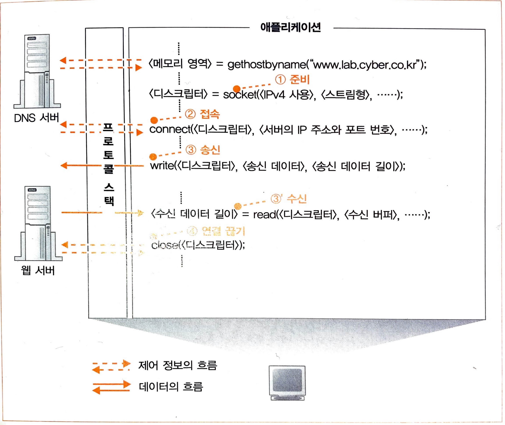

# 소켓을 이용한 데이터 송수신

## 데이터 송수신 동작 과정

1. 소켓 생성 (소켓 작성 단계)
2. 서버측의 소켓에 파이프를 연결 (접속 단계)
3. 데이터 송수신 (송수신 단계)
4. 파이프를 분리하고 소켓을 말소 (연결 끊기 단계)

앞의 네 가지 동작을 실행하는 것은 OS 내부의 프로토콜 스택입니다.

&nbsp;

## 소켓 작성 단계

&nbsp;

&nbsp;

Socket 라이브러리의 socket 호출한다. 소켓이 생기면 디스크립터라는 것이 반환된다. 애플리케이션은 이것을 받아서 메모리에 기록해둔다. 디스크립터는 소켓을 식별하는데 사용된다.

&nbsp;

## 파이프를 연결하는 접속 단계

만들어진 소켓을 서버측의 소켓에 접속하도록 프로토콜 스택에 의뢰합니다. 애플리케이션은 Socket 라이브러리의 connect 함수를 호출해서 이 의뢰 동작을 실행합니다. 여기에서의 요점은 connect를 할 때 지정하는 디스크립터, 서버의 IP주소, 포트 번호라는 세 가지 값입니다. 

디스크립터는 컴퓨터 한 대의 내부에서 소켓을 식별하기 위해 사용하지만, 포트 번호는 접속 상대측에서 소켓을 식별하기 위해 사용합니다. 

connect를 호출하면 프로토콜 스택이 접속 동작을 실행합니다. 그리고 상대와 연결되면 프로토콜 스택은 연결된 상대의 IP 주소나 포트 번호 등의 정보를 소켓에 기록합니다. 이로써 데이터 송수신이 가능한 상태가 됩니다.

&nbsp;

## 메시지를 주고받는 송수신 단계

애플리케이션은 송신 데이터를 메모리에 준비합니다. 그리고 write를 호출할 때 디스크립터와 송신 데이터를 지정합니다. 그러면 프로토콜 스택이 송신 데이터를 서버에 송신합니다. 이 때 송신 데이터는 네트워크를 통해 전부 그대로 액세스 대상의 서버에 도착합니다. 그러면 서버는 수신 동작을 실행하여 받은 데이터의 내용을 조사하고 적절한 처리를 실행하여 응답 메시지를 반송합니다.

이 메시지가 돌아오면 이번에는 메시지를 송신하는 동작입니다. 수신할 때는 Socket 라이브러리의 read 함수를 통해 프로토콜 스택에 수신 동작을 의뢰합니다. 이때 수신한 응답 메시지를 저장하기 위한 메모리 영역을 지정하는데, 이 메모리 영역을 수신 버퍼라고 부릅니다. 그러면 응답 메시지가 돌아올 때 read가 받아서 수신 버퍼에 저장합니다. 수신 버퍼는 애플리케이션 프로그램의 내부에 마련된 메모리 영역이므로 수신 버퍼에 메시지를 저장한 시점에서 메시지를 애플리케이션에 건네줍니다.

&nbsp;

## 연결 끊기 단계

브라우저가 데이터 수신을 완료하면 송수신 동작은 끝납니다. 그 후 Socket 라이브러리의 close 함수를 호출하여 연결 끊기 단계로 들어가도록 의뢰합니다. 그러면 소켓 사이를 연결한 파이프와 같은 것이 분리되고 소켓도 말소됩니다.

이때의 동작은 다음과 같습니다. 웹에서 사용하는 HTTP 프로토콜에서는 본래 응답 메시지의 송신을 완료했을 때 웹 서버측에서 연결 끊기 동작을 실행하므로 먼저 웹 서버 측에서 close를 호출하여 연결을 끊습니다. 그리면 이것이 클라이언트측에 전달되어 클라이언트의 소켓은 연결 끊기 단계로 들어갑니다. 그리고 브라우저가 read로 수신 동작을 의뢰했을 때 read는 수신한 데이터를 건네주는 대신 송수신 동작이 완료되어 연결이 끊겼다는 사실을 브라우저에 통지합니다. 이로써 송수신이 종료되었다는 것을 알 수 있으므로 브라우저에서도 close를 호출하여 연결 끊기 단계에 들어갑니다.

&nbsp;

Excerpt From <성공과 실패를 결정하는 1%의 네트워크 원리> by Tsutomu Tone