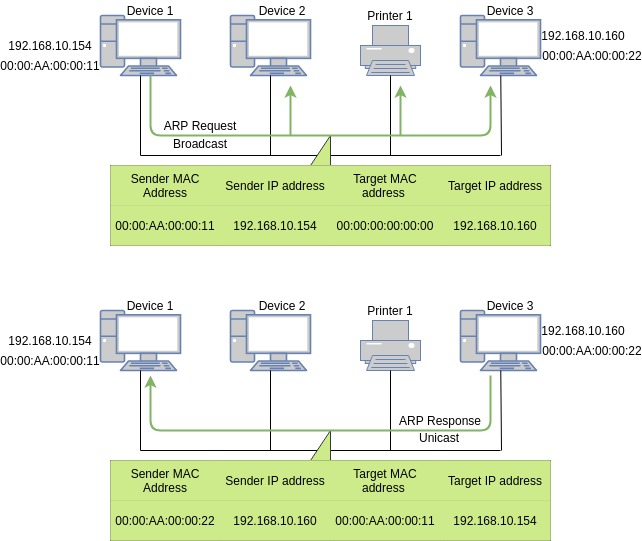
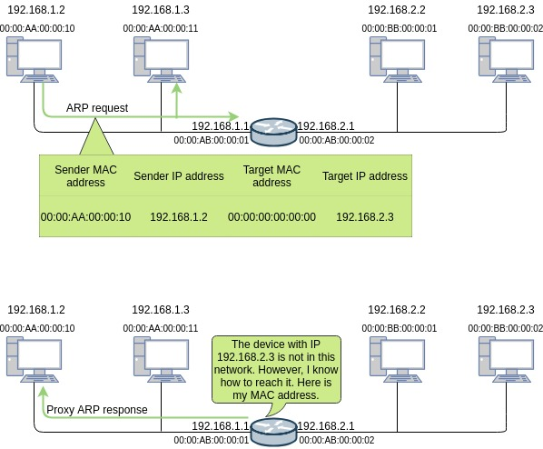

# 서브넷과 게이트웨이

## 서브넷과 게이트웨이의 용도

로컬 네트워크에서는 ARP 브로드캐스트를 이용해 도착지 MAC 주소를 학습할 수 있고 이 MAC 주소를 이용해 직접 통신할 수 있지만 원격 네트워크 통신은 네트워크를 넘어 전달되지 못하는 브로드캐스트의 성질 때문에 네트워크 장비의 도움이 필요합니다. 이 장비를 '게이트웨이'라고 하고 게이트웨이에 대한 정보를 PC나 네트워크 장비에 설정하는 항목이 '기본 게이트웨이'입니다.

동일 네트워크 간의 통신과 서로 다른 네트워크 간의 통신을 구분하기 위해 사용되는 것이 서브넷 마스크입니다. 로컬 통신은 단순한 ARP 요청으로 목적지를 찾아 통신할 수 있지만 원격지 통신은 ARP가 라우터를 넘어가지 못하는 브로드캐스트이므로 외부와 통신이 가능한 장비의 도움이 필요합니다.

&nbsp;

## 2계층 통신 vs 3계층 통신

단말 간을 연결해주는 네트워크 장비에서 2계층까지만 정보를 확인해 통신하고 ARP 요청을 보낼 때 직접 브로드캐스트를 이용하므로 이를 L2 통신이라고 부릅니다. 

반면, 원격지 네트워크와 통신해야 할 경우, 라우터와 같은 3계층 장비의 도움이 없으면 통신할 수 없습니다. 해당 패킷을 전송하는 네트워크 장비에서 3계층 정보까지 확인해야 하며 이것을 L3 통신이라고 합니다.

&nbsp;

&nbsp;

같은 네트워크에 있는 단말 간 통신은 직접적으로 이루어집니다. 상대방의 MAC 주소를 알아내기 위해 ARP 브로드캐스트를 이용하고 상대방의 MAC 주소를 알아내자마자 패킷이 캡슐화되어 통신이 시작됩니다.

&nbsp;

&nbsp;

외부 네트워크와 통신이 필요할 때는 단말이 자신이 직접 보낼 수 없는 위치에 목적지가 있다고 판단하고 ARP 요청을 기본 게이트웨이의 IP 주소로 요청합니다. 

게이트웨이에서 ARP 응답을 받은 단말은 도착지 MAC 주소에 응답받은 기본 게이트웨이의 MAC 주소를 적어넣고 통신을 시작합니다.

로컬 통신(L2 통신)은 도착지 MAC 주소와 도착지 IP 주소가 같은 반면, 원격지 통신은 도착지 MAC 주소와 도착지 IP 주소가 다릅니다. 도착지 IP 주소는 통신의 실제 도착지이고 도착지 MAC 주소는 디폴트 게이트웨이의 MAC 주소가 사용됩니다.

&nbsp;

Excerpt From <IT 엔지니어를 위한 네트워크 입문> by 고재성, 이상훈