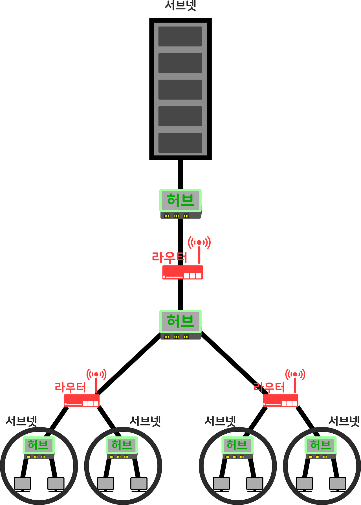
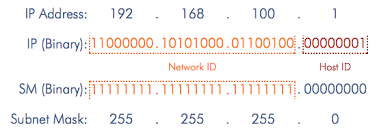

# TCP/IP 네트워크

&nbsp;

&nbsp;

TCP/IP 네트워크는 서브넷이라는 작은 네트워크를 라우터로 접속하여 전체 네트워크를 완성합니다. 여기에서 말하는 서브넷이란, 허브에 몇 대의 PC가 접속된 것이라고 생각해도 좋습니다. 이것을 한 개의 단위로 생각하여 '서브넷'이라고 부르는데, 라우터에서 연결하면 네트워크 전체가 완성됩니다.

여가애 '00동 00번지'라는 형태로 네트워크의 주소를 할당합니다. 동에 해당하는 번호를 서브넷에 할당하고, 번지에 해당하는 번호를 컴퓨터에 할당한 것이 네트워크의 주소입니다. 이 동에 해당하는 번호를 네트워크 번호라고 하고, 번지에 해당하는 번호를 호스트 번호라 하며, 이 두 주소를 합쳐서 IP 주소라고 합니다.

## 넷마스크

&nbsp;

&nbsp;

네트워크 주소를 구하기 위해서는 넷마스크라는 것이 필요합니다. 넷마스크는 서브넷에 해당하는 번호를 1로, 호스트에 해당하는 번호를 0으로 표시한 것입니다. 이것을 이용하여 네트워크 주소를 구할 수 있습니다.

호스트 번호 부분의 비트 값이 모두 0 또는 1인 경우는 특별한 의미를 가집니다. 호스트 번호 부분이 모두 0인 IP주소는 각각의 기기를 나타내는 것이 아니라 **서브넷 자체**를 나타냅니다. 또한 호스트 번호 부분이 모두 1이면 서브넷이 있는 기기 전체에 패킷을 보내는 **브로드캐스트**를 나타냅니다.

&nbsp;

Excerpt From <성공과 실패를 결정하는 1%의 네트워크 원리> by Tsutomu Tone