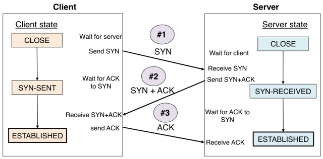

# TCP와 UDP

&nbsp;

&nbsp;

## 4계층 프로토콜과 서비스 포트

TCP/IP 프로토콜 스택에서 4계층은 TCP와 UDP가 담당합니다. 4계층의 목적은 목적지를 찾아가는 주소가 아니라 애플리케이션에서 사용하는 프로세스를 정확히 찾아가고 데이터를 분할한 패킷을 잘 쪼개 보내고 잘 조립하는 것입니다.

TCP/IP 프로토콜 스택에서 4계층의 상위 프로토콜 지시자는 포트 번호입니다. 

&nbsp;

## TCP

TCP 프로토콜은 신뢰할 수 없는 공용망에서도 정보유실 없는 통신을 보장하기 위해 세션을 안전하게 연결하고 데이터를 분할하고 분할된 패킷이 잘 전송되었는지 확인하는 기능이 있습니다.

패킷에 번호(Sequence Number)를 부여하고 잘 전송되었는지에 대해 응답(Acknowledge Number)합니다. 또한, 한꺼번에 얼마나 보내야 수신자가 잘 받아 처리할 수 있는지 전송 크기(Window Size)까지 고려해 통신합니다.

&nbsp;

### 패킷 순서, 응답 번호

TCP에서는 분할된 패킷을 잘 분할하고 수신 측이 잘 조합하도록 패킷에 순서를 주고 응답 번호를 부여합니다. 패킷에 순서를 부여하는 것을 시퀀스 번호, 응답 번호를 부여하는 것을 ACK 번호라고 부릅니다. 두 번호가 상호작용해 순서가 바뀌거나 중간에 패킷이 손실된 것을 파악할 수 있습니다.

&nbsp;

### 윈도 사이즈와 슬라이딩 윈도

데이터를 보낼 때 패킷을 하나만 보내는 것이 아니라 많은 패킷을 한꺼번에 보내고 응답을 하나만 받습니다. 가능하면 최대한 많은 패킷을 한꺼번에 보내는 것이 효율적이지만 네트워크 상태가 안 좋으면 패킷 유실 가능성이 커지므로 적절한 송신량을 결정해야 하는데 한 번에 데이터를 받을 수 있는 데이터 크기를 **윈도 사이즈**라고 하고 네트워크 상황에 따라 이 윈도 사이즈를 조절하는 것을 **슬라이딩 윈도**라고 합니다.

&nbsp;

### 3방향 핸드셰이크

&nbsp;

&nbsp;

TCP에서는 유실없는 안전한 통신을 위해 통신 시작 전, 사전 연결 작업을 진행합니다. 목적지가 데이터를 받을 준비가 안 된 상황에서 데이터를 일방적으로 전송하면 목적지에서는 데이터를 정상적으로 처치할 수 없어 데이터가 버려집니다.

TCP에서는 3번의 패킷을 주고받으면서 통신을 서로 준비하므로 '3방향 핸드셰이크'라고 부릅니다.

## UDP

UDP는 데이터 전송을 보장하지 않는 프로토콜이므로 제한된 용도로만 사용됩니다. UDP는 음성 데이터나 실시간 스트리밍과 같이 시간에 민감한 프로토콜이나 애플리케이션을 사용하는 경우나 사내 방송이나 증권 시세 데이터 전송에 사용되는 멀티캐스트처럼 단방향으로 다수의 단말과 통신해 응답을 받기 어려운 환경에서 주로 사용됩니다.

UDP는 TCP와 달리 통신 시작 전, 3방향 핸드셰이크와 같이 사전에 연결을 확립하는 절차가 없습니다. 그 대신 UDP에서는 첫 데이터는 리소스 확보를 위해 인터럽트를 거는 용도로 사용되고 유실됩니다. 그래서 UDP 프로토콜을 사용하는 애플리케이션이 대부분 이런 상황을 인지하고 동작하거나 연결 확립은 TCP 프로토콜을 사용하고 애플리케이션끼리 모든 준비를 마친후 실제 데이터한 UDP를 이용하는 경우가 대부분입니다.

&nbsp;

Excerpt From <IT 엔지니어를 위한 네트워크 입문> by 고재성, 이상훈