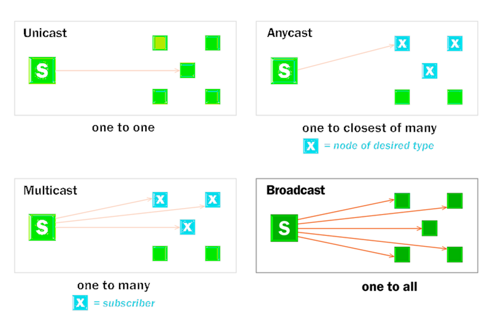

# 유니캐스트, 멀티캐스트, 브로드캐스트, 애니캐스트

&nbsp;

&nbsp;
## 유니캐스트

출발지와 목적지가 명확히 하나로 정해져 있는 1:1 통신 방식

## 멀티캐스트

멀티캐스트 그룹 주소를 이용해 해당 그룹에 속한 다수의 호스트로 패킷을 전송하기 위한 통신 방식.

## 브로드캐스트

목적지 주소가 모든으로 표기되어 있는 통신 방식.

## 애니캐스트

애니캐스트 주소가 같은 호스트들 중에서 가장 가깝거나 가장 효율적으로 서비스할 수 있는 호스트와 통신하는 방식.

|타입|통신 대상|범위|IPv4|IPv6|예제|
|:---:|:---:|:---:|:---:|:---:|:---:|
|유니캐스트|1:1|전체 네트워크|O|O|HTTP|
|브로드캐스트|1:모든|서브넷(로컬 네트워크)|O|X|ARP|
|멀티캐스트|1:그룹|정의된 구간|O|O|방송|
|애니캐스트|1:1|전체 네트워크|△|O|DNS|

