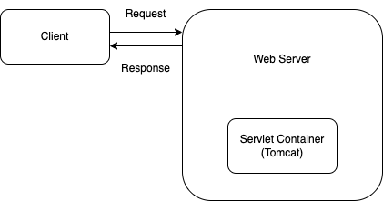

## 서블릿 응답과 요청 수행

웹 브라우저가 서블릿에 요청을 하면 먼저 톰켓 컨테이너가 받습니다. 그런 다음 사용자의 요청이나 응답에 대한 HttpServletRequest 객체와 HttpServletResponse 객체를 만들고 서블릿의 doGet()이나 doPost() 메서드를 호출하면서 이 객체들을 전달합니다.

톰캣이 사용자의 요청에 대한 정보를 모든 HttpServletRequest 객체의 속성으로 담아 메서드로 전달하므로 각 HttpServletRequest에서 제공하는 메서드들은 매개변수로 넘어온 객체들을 이용하여 사용자가 전송한 데이터를 받아 오거나 응답할 수 있는 것입니다.
