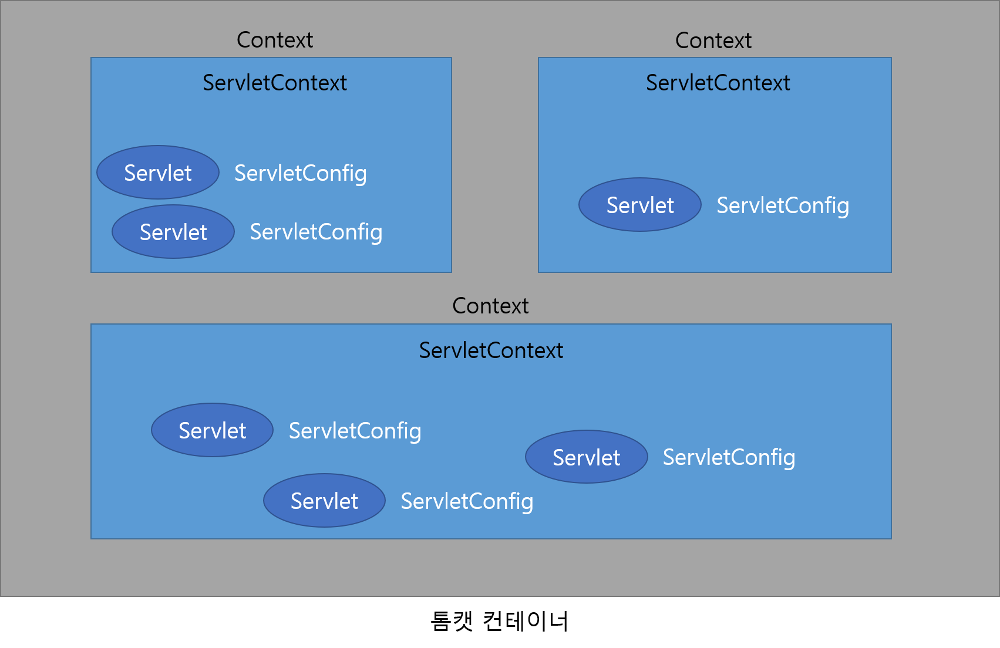

# Servlet Context & Config

## ServletContext 특징

- javax.servlet.ServletContext로 정의되어 있습니다.
- 서블릿과 컨테이너 간의 연동을 위해 사용합니다.
- 컨텍스트(웹 애플리케이션)마다 하나의 ServletContext가 생성됩니다.
- 서블릿끼리 자원(데이터)을 공유하는 데 사용합니다.
- 컨테이너 실행 시 생성되고 컨테이너 종료 시 소멸됩니다.

## ServletContext 기능

- 서블릿에서 파일 접근 기능
- 자원 바인딩 기능
- 로그 파일 기능
- 컨텍스트에서 제공하는 설정 정보 제공 기능

아래 그림에는 톰캣 컨테이너를 실행할 때 각 애플리케이션에서 생성되는 ServletContext와 ServletConfig 객체를 나타내었습니다. ServletContext는 컨텍스트당 생성되는 반면에 ServletConfig는 각 서블릿에 대해 생성됩니다.

&nbsp;

## ServletConfig 특징

- ServletConfig는 javax.servlet 패키지에서 인터페이스로 선언되어 있으며, 서블릿에 대한 여러 가지 기능을 제공합니다. 
- 각 서블릿에서만 접근할 수 있으며 공유는 불가능합니다.
- ServletConfig는 서블릿 초기화 시 생성되고 서블릿 종료 시 소멸됩니다.

## ServletConfig 기능

- ServletContext 객체를 얻는 기능
- 서블릿에 대한 초기화 작업 기능

&nbsp;

Excerpt From <자바 웹을 다루는 기술> by 이병승