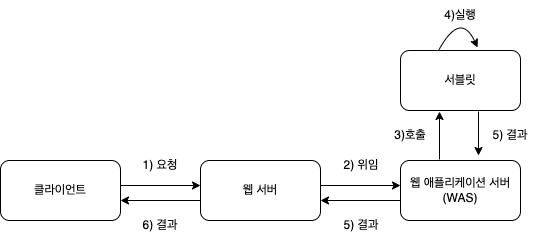

## 서블릿
서블릿은 서버 쪽에서 실행되면서 클라이언트 요청에 따라 동적으로 서비스를 제공하는 클래스입니다. 서블릿은 자바로 작성되어 있으므로 자바의 일반적인 특징을 모두 가집니다. 하지만 서블릿은 일반 자바 프로그램과 다르게 독자적으로 실행되지 못하고 톰캣과 같은 JSP/Servlet 컨테이너에서 실행된다는 점에서 차이가 있습니다.

## 서블릿의 동작 과정

클라이언트가 웹 서버에 요청하면 웹 서버는 그 요청을 톰캣과 같은 웹 애플리케이션 서버에 위임합니다. 그러면 WAS는 각 요청에 해당하는 서블릿을 실행합니다. 그리고 서블릿은 요청에 대한 기능을 수행한 후 결과를 반환하여 클라이언트에 전송합니다.

## 서블릿의 특징
- 서버 쪽에서 실행되면서 기능을 수행
- 기존의 정적인 웹 프로그램의 문제점을 보완하여 동적인 여러 가지 기능을 제공
- 스레드 방식으로 실행
- 자바로 만들어져 자바의 특징을 가짐
- 컨테이너에서 실행
- 컨테이너 종류에 상관없이 실행
- 보안 기능을 적용하기 용이
- 웹 브라우저에서 요청 시 기능 수행

From <자바 웹을 다루는 기술> by 이병승