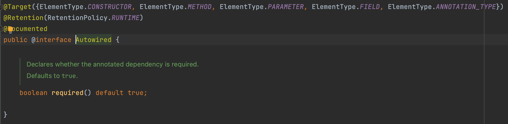
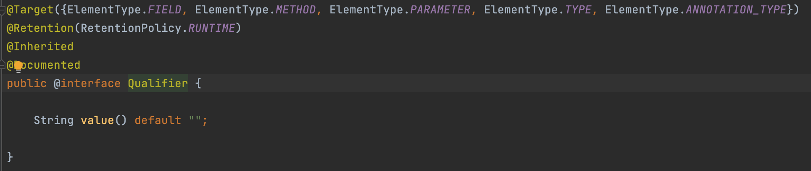

# 의존성 주입

## 의존성

UML (Unified Modeling Language) 용어인 의존성(dependency)은 모델 요소 사이의 연관 관계를 의미한다. 일반적으로 클래스 다이어그램에서 어떤 클래스가 다른 클래스를 참조하는 것을 '의존성이 있다'고 한다. 다시 말하면 한 클래스가 다른 클래스의 메소드를 사용한다면 두 클래스 사이에는 의존성이 발생한다.

### 의존성 역전의 원칙

소프트웨어 기능은 클래스들의 조합으로 완성되는 것이므로 의존 관계는 항상 존재한다. 의존성 역전의 원칙은 의존 관계를 맺을 때 쉽게 변하는 것보다 변화가 없는 것에 의존하라고 한다. 이는 하위 모듈이 변경될 때 상위 모듈이 변경되는 것을 막고자 의존 관계를 끊는 것을 의미한다.

클래스보다 인터페이스나 추상 클래스와 의존 관계를 맺는 것이 유연한 프로그래밍에 도움이 된다. 이 경우 상위 모듈은 하위 모듈에서 관심이 분리된다. 하위 모듈을 생성하고 초기화하는 과정을 더 이상 상위 모듈에서 코딩할 필요 없다. 이를 약한 결합이라고 한다.

의존성 역전의 원칙을 패턴화한 것이 제어의 역전(Inversion of Control, IoC)패턴이다. 그리고 패턴을 구현한 구현 방법이 바로 팩토리 메서드, 서비스 로케이터, 의존성 주입이다. 의존성 주입은 외부에서 외부에서 객체를 생성하여 대상 객체에 넣어 주는 것을 의미한다.

&nbsp;

## 애너테이션 기반 설정의 의존성 주입

의존성 주입 과정에는 의존성을 주입받을 객체와 의존성 대상 객체가 있어야 한다. 의존성 대상 객체를 주입받을 클래스 내부에는 객체를 저장할 변수에 ``@Autowired``와 ``@Qualifier`` 애너테이션을 조합해서 정의하면 된다. 스프링 컨테이너는 정의된 ``@Autowired``와 ``@Qualifier``의 속성 값을 파악해서 적절한 의존성 대상 객체를 찾아 주입한다. 의존성 주입을 하는 스프링 컨테이너는 의존성을 주입받을 객체와 의존성 대상 객체 모두 관리해야 한다. 다시 말하면 의존성 주입 과정에 필요한 두 객체 모두 스프링 빈 객체여야 한다.

&nbsp;

``@Autowired`` 애너테이션은 의존성이 필요한 클래스 내부에 의존성 주입을 받는 곳을 표시한다. 의존성을 주입받는 클래스 내부에 생성자, 메서드, 파라미터, 필드 등에 선언할 수 있다. 

&nbsp;

``@Qualifier``는 의존성을 주입할 스프링 빈 이름을 정의하는 역할을 한다. 클래스 타입은 같지만 이름이 각자 다른 여러 스프링 빈 중 정의된 이름의 스프링 빈을 주입받기 위해 ``@Qualifier``를 사용한다. 

``@Autowired`` 애너테이션은 여러 위치에 정의할 수 있으며, 정의된 위치에 따라 세 가지 방식으로 구분한다. 필드에 ``@Autowired``가 정의되어 있으면 필드 주입, Setter 메서드에 정의되어 있으면 Setter 메서드 주입, 생성자에 정의되어 있으면 생성자 주입으로 구분할 수 있다.

``@Autowired`` 애너테이션에 의한 의존성 주입은 클래스 타입에 의한 주입을 실행한다. 그래서 같은 클래스 타입의 이름이 다른 여러 클래스 빈이 있다면 ``@Qualifier``를 사용해야 한다. 이때는 이름에 의한 주입이 실행된다.

의존성 주입을 하려면 ``@Autowired`` 애너테이션을 함께 사용해야 한다. 하지만 생성자 주입 방식을 사용하는 경우 ``@Autowired`` 애너테이션을 생략할 수 있는 관례가 있다. , 빈 컨테이너는 하나밖에 없는 생성자를 찾아 생성자 의존성 주입을 실행한다.

필자는 세 가지의 의존성 주입 방식 중에서 생성자 주입 방식을 사용하길 권한다. 필드 주입이나 Setter 메서드 주입 방식에 비해 코드가 간결하기 때문이다. 하나의 클래스가 다른 여러 클래스에 의존성이 있을 때 코드는 더욱 간결해진다. 필드 주입 방식은 ``@Autowired`` 및 ``@Qualifier`` 애너테이션들을 반복적으로 선언해야 한다. 마찬가지로 Setter 메서드 주입 방식도 클래스에 불필요한 여러 Setter 메서드들을 선언해야 한다. Setter 메서드는 개발자 의도와 다르게 런타임 도중 다른 객체가 호출할 수 있다는 단점이 있다. 즉, 초기 설정된 스프링 빈 객체가 다른 개발자 실수로 호출된 Setter 메서드로 애플리케이션 런타임 도중 객체의 상태가 바뀌는 것은 잠재적인 버그가 될 수 있다.

생성자 주입의 가장 큰 장점은 테스트 케이스를 작성할 때 Mock 객체를 주입하기 편리하다는 것이다. new 키워드를 사용하여 테스트 대상 클래스를 생성할 때 생성자의 인자들은 테스트 대상 객체가 의존하는 객체들이다. 이때 Mock 객체나 테스트 시나리오 상황에 적합한 응답을 하는 더미 객체를 임시로 만들어 주입할 수 있다. 이에 비해 필드 주입 방식으로 설계된 클래스는 외부에서 Mock 객체를 주입하기 쉽지 않다. 보통 클래스의 멤버 변수들은 private 키워드가 선언되어 캡슐화되어 있다. 그래서 클래스 외부에서 접근이 자유롭지 못하다. 이 상황에서 테스트 케이스를 작성할 때는 자바 리플렉션 기법을 사용하거나 테스트 프레임워크를 사용하여 mocking 작업을 해야 한다.

&nbsp;

## 자바 설정의 의존성 주입

``@Bean``, ``@Configuration`` 애너테이션을 사용한 자바 설정에서도 스프링 빈끼리 의존성 주입이 가능하다. 물론 앞서 설명한 ``@Autowired``와 ``@Qualifier``를 사용해서 자바 설정에서도 의존성 주입 설정을 할 수 있다. 하지만 자바 설정에서는 많은 개발자들가 스프링 빈 사이의 참조를 이용하여 의존성 주입 설정을 한다.

의존 관계는 의존성 방향에 따라 상위 모듈과 하위 모듈로 구분할 수 있다. 그리고 상위 모듈은 하위 모듈에 의존한다. 의존성 주입 과정에서 상위 모듈보다 하위 모듈이 먼저 생성되어야 한다. 상위 모듈 객체를 생성할 때 하위 모듈 객체를 주입할 수 있다. 스프링 빈을 생성하고 의존성 주입을 하는 스프링 컨테이너는 이 순서에 맞게 빈의 생성 순서를 결정한다. 그래서 스프링 컨테이너는 다음 과정으로 스프링 빈의 우선순위를 결정한다.

1. ``ApplicaionContext``가 실행될 때 우선 설정 파일을 읽는다. 이때 생성해야 할 스프링 빈은 설정 파일에도 있다.
2. 설정 파일에 포함된 ``@ComponentScan``으로 설정된 패키지 경로에 있는 스프링 빈 설정을 로딩한다.
3. 찾아낸 스프링 빈들의 의존성을 검사한다.
4. 하위 모듈에서 상위 모듈 순으로 스프링 빈을 생성하고 순차적으로 스프링 빈 사이에 의존성 주입을 한다.

&nbsp;

Excerpt From <스프링 부트로 개발하는 MSA 컴포넌트> by 김병부
