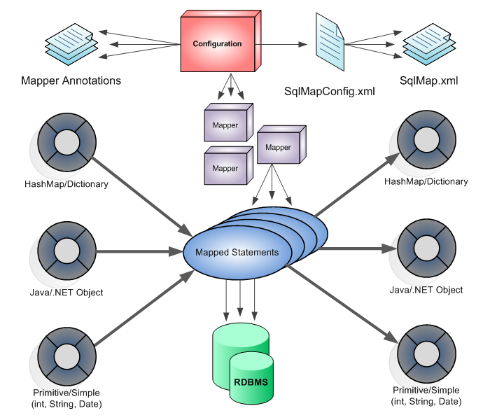

# 마이바티스 프레임워크

## 마이바티스 프레임워크 특징

- SQL 실행 결과를 자바 빈즈 또는 Map 객체에 매핑해 주는 Persistence 솔루션으로 관리. 즉, SQL을 소스 코드가 아닌 XML로 분리.
- SQL문과 프로그래밍 코드를 분리해서 구현.
- 데이터소스 기능과 트랜잭션 처리 기능을 제공.

&nbsp;

## 마이바이트 프레임워크 구조

&nbsp;

&nbsp;

1. SqlMapConfig.xml에 각 기능별로 실행할 SQL문을 SqlMap.xml에 미리 작성한 후 등록합니다.
2. 애플리케이션에서 데이터베이스와 연동하는 데 필요한 데이터를 각각의 매개변수에 저장한 후 마이바티스에 전달합니다.
3. 애플리케이션에서 요청한 SQL문을 SqlMap.xml에서 선택합니다.
4. 전달한 매개변수와 선택한 SQL문을 결합합니다.
5. 매개변수와 결합된 SQL문을 DBMS에서 실행합니다.
6. DMBS에서 반환된 데이터를 애플리케이션에서 제공하는 적당한 매개변수에 저장한 후 반환합니다.

다시 정리하면 데이터베이스 연동 시 사용되는 SQL문을 미리 SqlMapConfig.xml에 작성해 놓고 애플리케이션에서 데이터베이스 연동 시 해당 SQL에서 사용될 데이터를 지원하는 해당 매개변수에 저장한 후 SQL문에 전달합니다. 전달된 매개변수와 SQL문을 결합해 SQL문을 DBMS로 전송하여 실행합니다. 그리고 그 결과를 애플리케이션에서 제공하는 자료형으로 반환합니다.

&nbsp;

Excerpt From <자바 웹을 다루는 기술> by 이병승