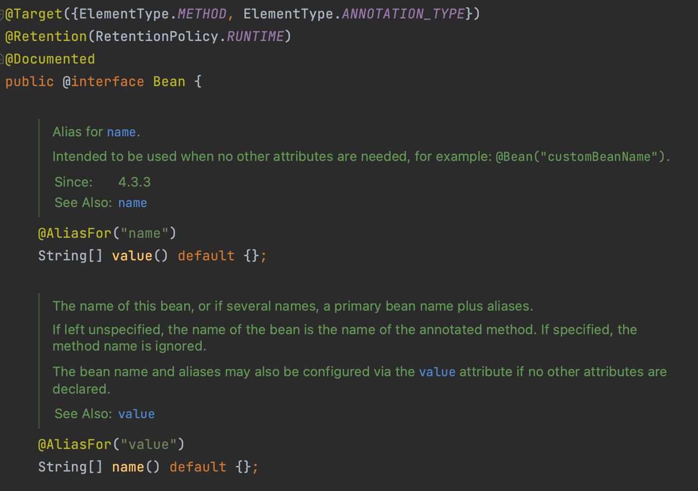

# Spring Bean

## 스프링 빈의 특징

- 스프링 빈 컨테이너가 관리하는 순수 자바(POJO) 객체
- 스프링 빈 컨테이너가 스프링 빈을 생성, 주입, 종료까지 관리한다. 이때 여러 단계를 거치는데 이를 **스프링 빈 생명주기**라고 한다.
- 스프링 빈이 다른 스프링 빈을 참조할 수 있다. 스프링 빈 컨테이너가 참조되는 스프링 빈에 적합한 객체를 넣어 준다. 이 과정을 주입이라고 한다.
- 스프링 빈의 이름이나 클래스 타입 정보를 사용하여 스프링 빈 컨테이너에서 적절한 스프링 빈 객체를 찾을 수 있다. 찾은 스프링 빈 객체를 다른 스프링 빈 객체의 멤버 변수로 넣어 주거나 정해진 메서드의 인수로 넣어 줄 수 있다. 이 과정을 주입이라고 하며, 이를 **의존성 주입**이라고 한다.
- 스프링 빈은 이름, 클래스 타입, 객체로 구성된다. 같은 클래스 타입이라도 스프링 빈 이름이 다르다면 다른 스프링 빈이다. 그러므로 클래스 타입은 같지만 이름이 다른 여러 스프링 빈이 컨테이너에 있을 수 있다.

&nbsp;

## 스프링 부트 프레임워크에서 스프링 빈을 정의하는 방법

- 자바 설정 클래스에서 ``@Bean`` 애너테이션을 사용하여 정의
- 스테레오 타입 애너테이션을 사용하여 정의
- ``o.s.beans.factory.config.BeanDefinition`` 인터페이스를 구현하여 정의하는 방법
- XML 설정 방식을 사용하는 방법

스프링 빈을 정의하는 방법은 스프링 빈 컨테이너 구현체에 따라 결정된다. 스프링 빈 컨테이너는 설정 파일을 먼저 로딩하는데, ``ApplicationContext`` 구현체 종류에 따라 설정 파일의 포맷이 다르다. 스프링 부트 프레임워크가 기본 사용하는 ``ApplicationContext`` 구현체는 세 종류다. 하지만 모두 공통으로 애너테이션을 사용하여 스프링 빈을 정의하는 방식이다.

&nbsp;

## @Bean 애너테이션

&nbsp;

``@Bean`` 애너테이션의 타깃 속성은 ``ElemenetType.METHOD``다. 그러므로 메서드 선언부에 정의해야 한다. 스프링 빈을 정의할 때 필요한 요소는 스프링 빈 이름, 클래스 타입, 객체다.

스프링 빈의 이름을 설정하려면 ``@Bean``애너테이션의 속성인 ``value`` 또는 ``name``에 값을 설정한다. 하지만 이 속성은 필수가 아니다. 속성에 값을 설정하지 않으면 ``@Bean`` 애너테이션이 정의된 메서드 이름이 스프링 빈 이름이 된다. 스프링 빈의 클래스 타입은 ``@Bean`` 애너테이션이 정의된 메서드의 리턴 타입이 클래스 타입으로 사용된다. 스프링 빈 객체는 ``@Bean`` 애너테이션이 정의된 메서드가 리턴하는 객체가 된다.

&nbsp;

## 스트레오 타입 스프링 빈 

보통 스프링 개발자들은 애플리케이션 설정 영역과 비즈니스 로직 영역으로 용도를 나누어 각각 다른 방식으로 스프링 빈을 정의한다. 애플리케이션을 설정하는 상황에서 자바 설정을 이용한 ``@Bean``을 사용한다. 비즈니스 로직을 담당하는 클래스를 스프링 빈으로 설정하는 상황에서는 스테레오 타입 애너테이션을 사용하여 스프링 빈을 정의한다.

스테레오 타입 애너테이션으로 정의된 클래스들은 @ComponentScan으로 스캔되고 스프링 빈으로 생성된다. ``@Bean``을 자바 설정 방식이라고 한다면, 스테레오 타입 애너테이션들을 이용한 스프링  빈 등록은 애너테이션 기반 설정이라고 한다.

- ``@Component``: 클래스를 스프링 빈으로 정의하는데 사용하는 가장 일반적인 애너테이션이다. 
- ``@Controller``: 컨트롤러 역할을 하는 클래스를 스프링 빈으로 정의하는 데 사용한다. 컨트롤러는 사용자 요청을 먼저 처리하고, 이를 비즈니스 로직을 포함한 다른 컴포넌트에 전달하는 역할을 한다.
- ``@Service``: 도메인 주도 설계의 서비스 역할인 클래스에 정의하여 사용한다. 서비스는 사용자 행위에 해당하는 기능을 추상화하고, 여러 객체에서 일어나는 행위를 하나의 기능으로 모아서 처리하는 클래스를 의미한다. 보통 복잡한 형태의 비즈니스 로직을 구현한다.
- ``@Repository``: 도메인 주도 설계의 리포지터리를 의미하는 애너테이션이다. 객체를 저장,조회하는 행위를 담당하는 클래스를 의미한다.

&nbsp;

Excerpt From <스프링 부트로 개발하는 MSA 컴포넌트> by 김병부
