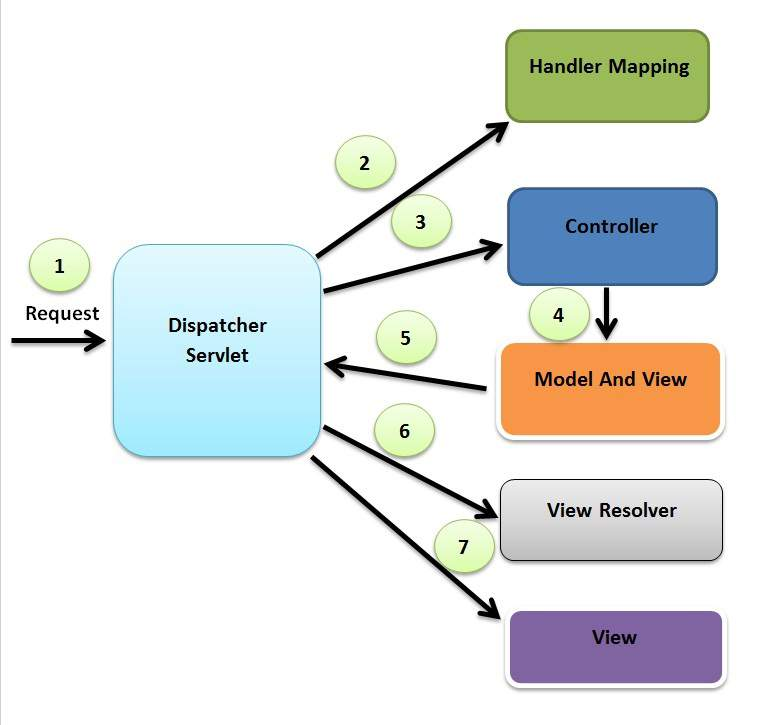

# Spring MVC

## 스프링 프레임워크 MVC 구성요소 

&nbsp;

&nbsp;

|구성요소|설명|
|:---|:---|
|DispatcherServlet|클라이언트의 요청을 전달받아 해당 요청에 대한 컨트롤러를 선택하여 클라이언트의 요청을 전달합니다. 또한 컨트롤러가 반환한 값을 View에 전달하여 알맞은 응답을 생성합니다.|
|HandlerMapping|클라이언트가 요청한 URL을 처리할 컨트롤러를 지정합니다.|
|Controller|클라이언트의 요청을 처리한 후 그 결과를 DispatcherServlet에 전달합니다.|
|ViewResolver|컨트롤러의 처리 결과를 전달할 뷰를 지정합니다.|
|View|컨트롤러의 처리 결과 화면을 생성합니다.|

## 스프링 프레임워크 MVC 동작 과정

1. 브라우저가 DispatcherServlet에 URL로 접근하여 해당 정보를 요청합니다.
2. 핸들러 매핑에서 해당 요청에 대해 매핑된 컨트롤러가 있는지 요청합니다.
3. 매핑된 컨트롤러에 대해 처리를 요청합니다.
4. 컨트롤러가 클라이언트의 요청을 처리한 결과와 View 이름을 ModelAndView 객체에 담습니다.
5. ModelAndView를 DispatcherServlet에 반환합니다.
6. DispatcherServlet에서는 컨트롤러에서 보내온 View 이름을 ViewResolver로 보내 해당 View를 요청합니다.
7. ViewResolver는 요청한 View를 보내고 View의 처리결과를 DispatcherServlet에 반환합니다.
8. DispatcherServlet은 최종 결과를 브라우저로 전송합니다.

&nbsp;

Excerpt From <자바 웹을 다루는 기술> by 이병승