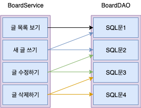

# 트랜잭션

트랜잭션(Transaction)은 여러 개의 DML 명령문을 하나의 논리적인 작업 단위로 묶어서 관리하는 것으로, ALL 또는 Nothing 방식으로 작업 단위가 처리됩니다. 즉 SQL 명령문들이 모두 정상적으로 처리되었다면 모든 작업의 결과를 데이터베이스에 영구 반영(commit)하지만 그중 하나라도 잘못된 것이 있으면 모두 취소(rollback)합니다. 

&nbsp;

&nbsp;

Service 클래스의 각 메서드가 애플리케이션의 단위 기능을 수행합니다. 단위 기능1은 DAO 클래스의 SQL문 하나로 기능을 수행하는 반면에 단위 기능2나 단위 기능3은 여러 개의 SQL문을 묶어서 작업을 처리합니다. 그런데 묶어서 작업을 처리할 때 어느 하나의 SQL문이라도 잘못되면 이전에 수행한 모든 작업을 취소해야만 작업의 일관성이 유지됩니다.

따라서 트랜잭션은 각 단위 기능 수행 시 이와 관련된 데이터베이스 연동 작업을 한꺼번에 묶어서 관리한다는 개념입니다.

&nbsp;

Excerpt From <자바 웹을 다루는 기술> by 이병승