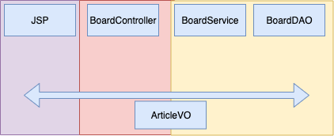

# 답변형 게시판 MVC 구조

&nbsp;

뷰와 컨트롤러는 그대로 JSP와 서블릿이 기능을 수행하지만 모델은 기존의 DAO 클래스 외에 BoardService 클래스가 추가된 것을 볼 수 있습니다.

지금까지 MVC로 기능을 구현할 때 모델 기능은 DAO 클래스가 수행했습니다. 하지만 실제로 개발을 할 때는 Service 클래스를 거쳐서 DAO 클래스의 기능을 수행하도록 구현합니다. 그렇다면 모델에서 Service 클래스를 두는 이유는 무엇일까요?

DAO는 데이터베이스에 접근하는 기능을 수행하고 Service는 실제 프로그램을 업무에 적용하는 사용자 입장에서 업무 단위, 즉 트랜잭선으로 작업을 수행합니다. 여기서 업무 단위란 '단위 기능'이라고도 하며, 사용자 입장에서 하나의 논리적인 기능을 의미합니다.

웹 애플리케이션에서 일반적으로 묶어서 처리하는 단위 기능에는 다음과 같은 것들이 있습니다.

- 게시판 글 조회 시 해당 글을 조회하는 기능과 조회 수를 갱신하는 기능
- 쇼핑몰에서 상품 주문 시 주문 상품을 테이블에 등록 후 주문자의 포인트를 갱신하는 기능
- 은행에서 송금 시 송금자의 잔고를 갱신하는 기능과 수신자의 잔고를 갱신하는 기능

실제 개발을 할 때에도 Service 클래스의 메서드를 이용해 큰 기능을 단위 기능으로 나눈 후 Service 클래스의 각 메서드는 자신의 기능을 더 세부적인 기능을 하는 DAO의 SQL문들을 조합해서 구현합니다. 이렇게 하는 이유는 유지보수나 시스템의 확장선 면에서 훨씬 유리하기 때문입니다.

예를 들어 가장 흔한 게시판 기능은 크게 다음과 같이 나눌 수 있습니다.

- 새 글 쓰기
- 글 보기
- 글 수정하기
- 글 삭제하기

즉, 각 글과 관련해 세부 기능을 수행하는 SQL문들을 DAO에서 구현하고, Service 클래스의 단위 기능 메서드에서 DAO에 만들어 놓은 SQL문들을 조합해서 단위 기능을 구현하는 것입니다. 아래 그림은 답변형 게시판의 모델 구조를 나타낸 것입니다. 

&nbsp;

&nbsp;

보통 게시판의 Service 클래스 기능은 BoardDAO의 각 메서드의 SQL문 조합으로 기능을 구현합니다.

&nbsp;

Excerpt From <자바 웹을 다루는 기술> by 이병승