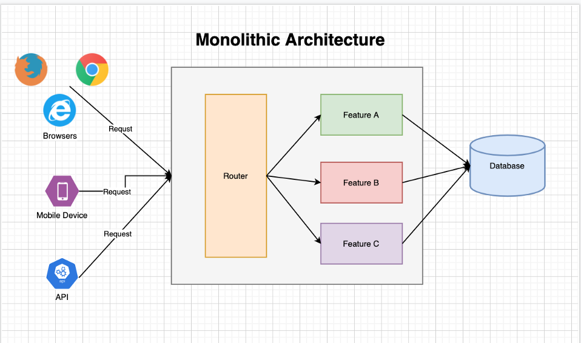

# 모놀리식 아키텍처

## 모놀리식 아키텍처란?

모놀리식 아키텍처는 하나의 시스템이 서비스 전체 기능을 처리하도록 설계한 것.

&nbsp;

## 모놀리식 아키텍처의 장점

보통 모놀리식 아키텍처로 애플리케이션을 설계할 때는 하나의 WAS (Web Application Server)에서 모든 기능을 처리하도록 구성한다. 그리고 데이터를 저장하기 위해 하나의 데이터 저장소를 사용한다. 일반적으로 RDB 같은 데이터 저장소를 사용한다. 그러므로 전반적으로 구조가 매우 간단하다.

&nbsp;

&nbsp;

간단한 구조 덕분에 시스템 운영과 개발이 편리한 장점이 있다. 개발자는 클래스 단위로 기능을 개발하면 되고, 데이터는 객체들 사이에서만 전달된다. 결국 서비스의 기능들은 클래스들의 유기적인 조합으로 이루어진다. 그러므로 모놀리식 아키텍처는 네트워크로 인한 지연이나 데이터 유실은 걱정할 필요가 없다. 시스템 장애나 기능에 버그가 있다면 개발자는 하나의 애플리케이션에서 원인을 파악하면 된다. 

또한 데이터 저장소가 하나이므로 RDB의 트랜잭션 기능을 쉽게 사용할 수 있다. 

정리하면 모놀리식 아키텍처로 설계된 시스템은 간단하게 개발할 수 있고, 쉽게 운영할 수 있는 장점이 있다. 게다가 간단한 구조이므로 장애에도 견고하다. 그래서 과거부터 지금까지도 많이 사용하는 아키텍처다.

&nbsp;

## 모놀리식 아키텍처의 단점

모놀리식 아키텍처는 간단하다. 하나의 애플리케이션 서버에서 여러 기능을 제공하므로 서비스 기능이 많아지면 더욱 복잡해질 수 있다.

서비스 규모가 커지면, 확장에 한계가 있으며 비효율적이다. 또한 기능이 많아질수록 개발 속도나 생산성이 낮아지므로 서비스 고도화에 한계가 생긴다. 

&nbsp;

Excerpt From <스프링 부트로 개발하는 MSA 컴포넌트> by 김병부