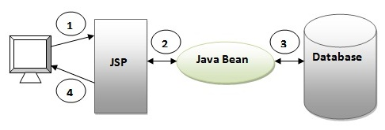

# 웹 애플리케이션 모델

웹 애플리케이션 개발은 일반적으로 많이 사용하는 표준화 소스 구조를 만들어 개발을 진행합니다. 이러한 표준화된 소스 구조를 웹 애플리케이션 모델이라고 합니다. 웹 애플리케이션 모델의 종류에는 모델1과 모델2 방식이 있습니다.

&nbsp;

## 모델 1 방식

데이터베이스 연동 같은 비즈니스 로직 작업과 그 작업 결과를 나타내주는 작업을 동일한 JSP에서 수행합니다. 즉, 모든 클라이언트의 요청과 비즈니스 로직 처리를 JSP가 담당하는 구조입니다.

&nbsp;

&nbsp;

모델 1 방식은 기능 구현이 쉽고 편리하다는 장점이 있는 반면에 요즘처럼 웹 사이트 화면 기능이 복잡해지면 화면 기능과 비즈니스 로직 기능이 섞이면서 유지보수에 문제가 생깁니다. 

&nbsp;

## 모델 2 방식

모델 2 방식의 핵심은 웹 애플리케이션의 각 기능(클라이언트의 요청 처리, 응답 처리, 비즈니스 로직 처리)을 분리해서 구현하자는 것입니다. 객체 지향 프로그래밍에서 각각의 기능을 모듈화해서 개발하자는 것과 같은 원리지요.

&nbsp;

&nbsp;

### 모델 2 방식의 특징

- 각 기능이 서로 분리되어 있어 개발 및 유지 보수가 쉽다.
- 각 기능(모듈)의 재사용성이 높다.
- 디자이너와 개발자의 작업을 분업화해서 쉽게 개발할 수 있다.
- 모델2 방식과 관련된 기능이나 개념의 학습이 필요하다.

&nbsp;

Excerpt From <자바 웹을 다루는 기술> by 이병승